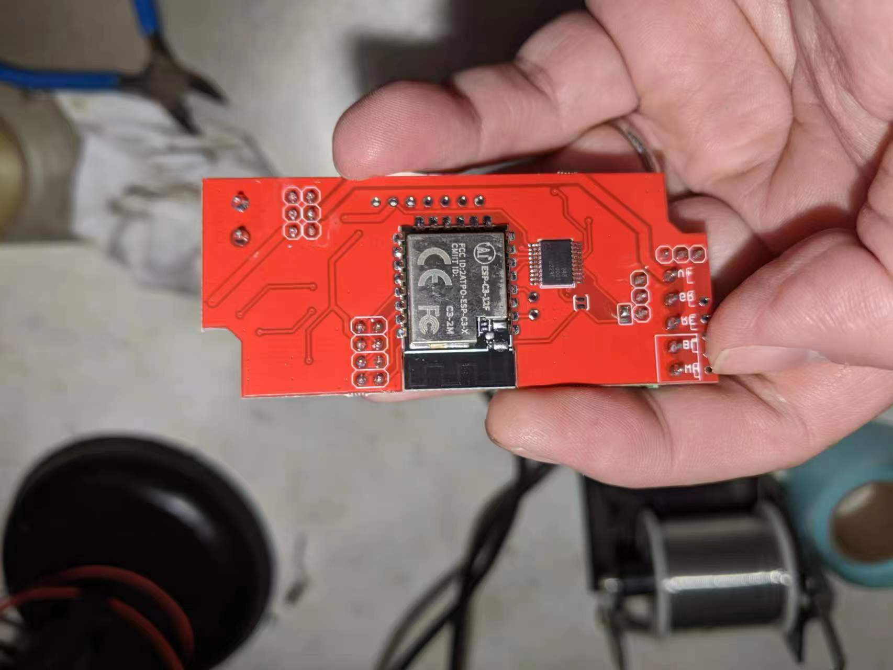
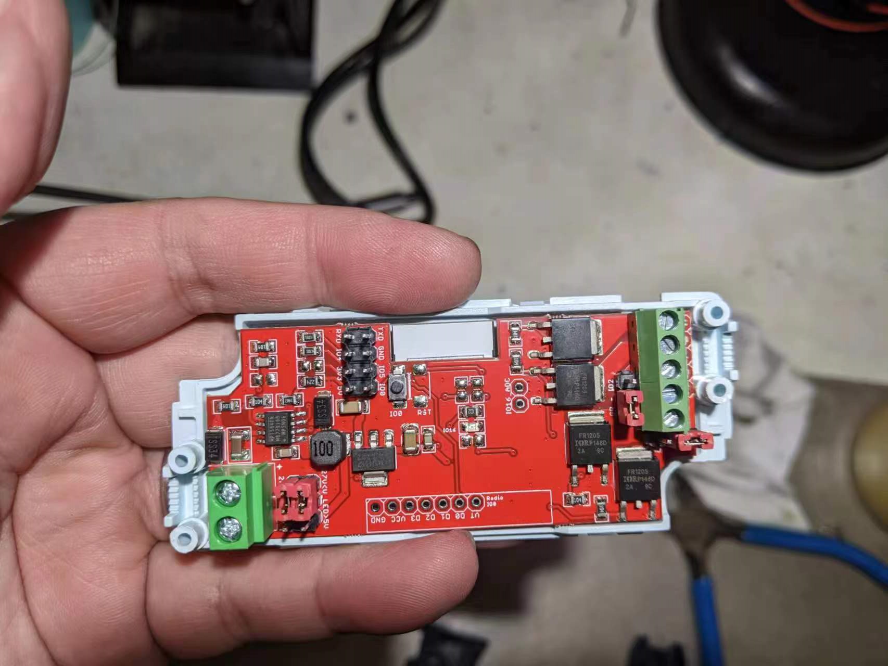

# NWI 1125

## The look 

### modifications from NWI1124 -> NWI1125

- removed reset pin 
- removed IO 0  pull up
- removed IO 2  pull up
- removed EN    pull up 
- removed IO 15 pull down

### map pins 

- [[ESP-12F-DAT]]
- [[ESP-C3-12F-DAT]]

#### [[ESP-12F-DAT]] (nwi1124) = [[ESP-C3-12F-DAT]] (nwi1125)

  - IO12 = IO4 = Blue
  - IO13 = IO5 = Green
  - IO14 = IO3 = White
  - IO15 = IO8 = Red
  - IO02 = IO10 = WS2812 
  - IO00 = IO9 = RF

#### [[ESP-12F-DAT]] (nwi1124) = [[ESPC2-12-DAT]] (nwi112x)

pin definitions :

| L: function | L: pins | note  |
| ----------- | ------- | ----- |
| ADC         | IO0     |       |
| EN          | IO1     |       |
| IO12        | IO4     | blue  |
| IO13        | IO5     | green |
| IO14        | IO3     | white |
| IO16        | IO2     |       |
| RST         | EN      |       |
| VCC         | VCC     |       |

| R: function | R: pins | note   |
| ----------- | ------- | ------ |
| GND         | GND     |        |
| IO0         | IO9     | RF     |
| IO15        | IO6     | red    |
| IO2         | IO7     | ws2812 |
| IO4         | IO10    |        |
| IO5         | IO18    |        |
| RXD         | RXD     |        |
| TXD         | TXD     |        |

## Code 
- please change the wifi hotspot name to match in the code 
- control by web URL in your browser 
- https://github.com/Edragon/Arduino-ESP32/tree/master/Sketchbook/BSP/NWI1125/webserver-path-1-ESP32-C3-12F