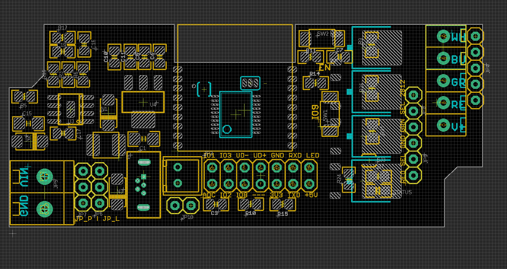
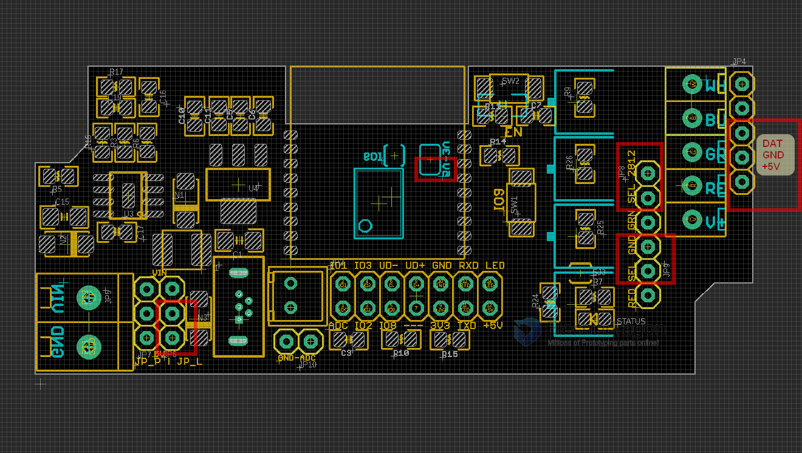
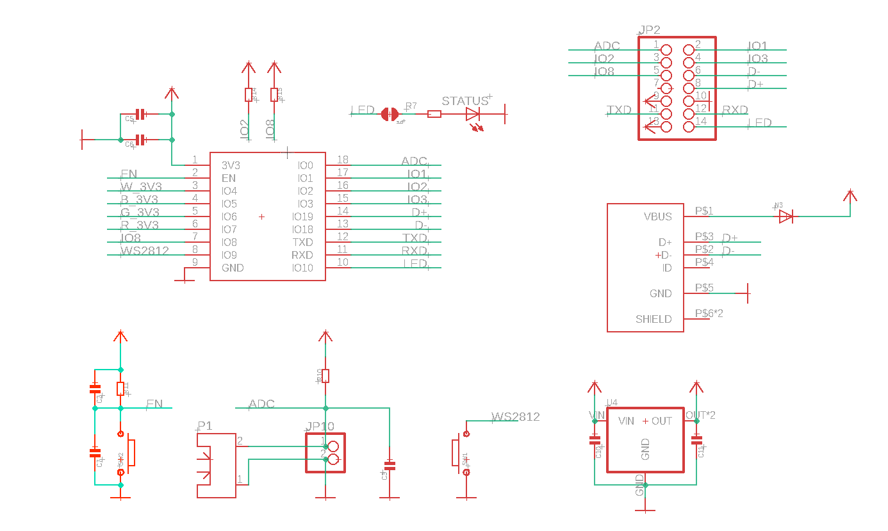
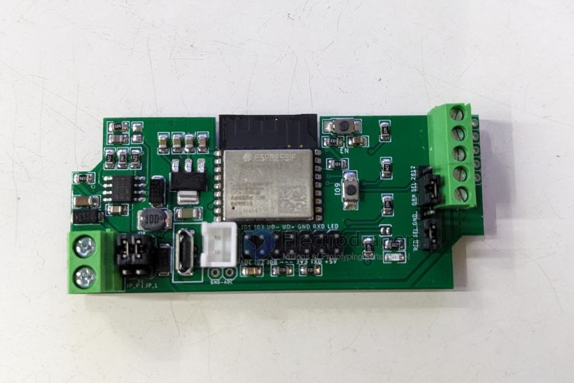
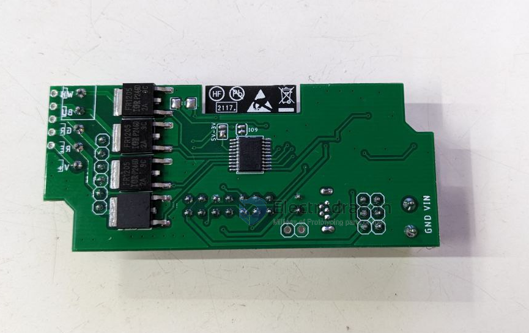
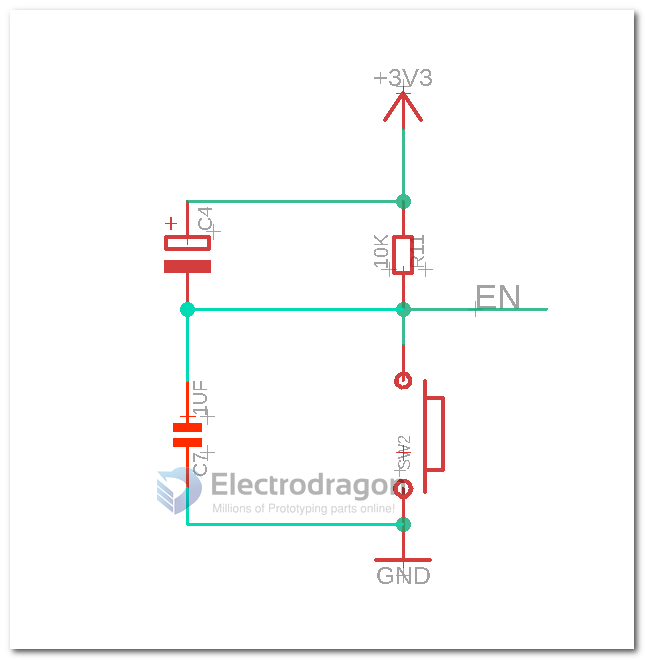
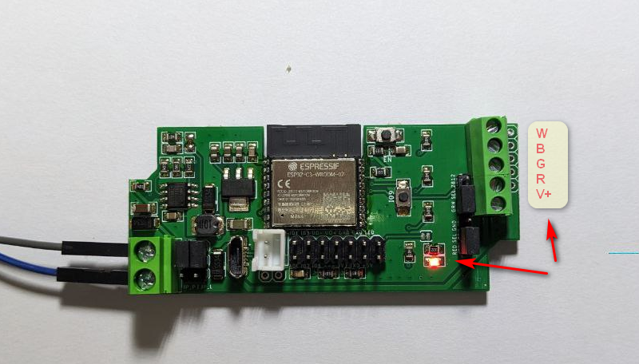

# NWI1126-DAT

## Pin Definitions

    #define OM_LED 10 // on module led
    #define WS_LED 9 // WS2812, select by jumper

    #define addc 0

    #define W_LED 4 // white
    #define B_LED 5 // blue
    #define G_LED 6 // green
    #define R_LED 7 //red

- IO9 button = program mode pin
- EN button = reset pin
- programmable LED pin 10

## Wiring Diagram

### Wiring for RGBW LED Strips

### Wiring for WS2812_5V

### Jumpers

| Jumper Name   | Option 1              | Option 2      | Function                                | Note    |
| ------------- | --------------------- | ------------- | --------------------------------------- | ------- |
| JP_P          | 5V, 12V, etc (ws2812) | 6~28V         | board system power supply               |         |
| JP_L          | 5V, 12V, etc (ws2812) | 6~28V         | led strip power supply                  |         |
| JP 8 (top)    | DAT (ws2812)          | Green         | reused pins for WRGB channels or WS2812 |         |
| JP 9 (bottom) | GND (ws2812)          | Red           | reused pins for WRGB channels or WS2812 |         |
| back_jumper   | ws2812_dat_3.3V       | ws2812_dat_5V | set ws2812 dat pin to 5V output default | default |

#### jumper setup cases

Case 1: Control RGBW 4 channel LED Strips

- LED strips power supply 6~28V (12V or 24V)
- Board power supply 6~28V

| jumper name | set          |
| ----------- | ------------ |
| JP_P        | 6~28V (top)  |
| JP_L        | 6~28V (top)  |
| back_jumper | default      |
| JP_8        | GNR (bottom) |
| JP_9        | RED (bottom) |

Case 2: Control WS2812 LED Strips

- LED strips power supply 5V
- Board power supply 6~28V

| jumper name | set                   | position |
| ----------- | --------------------- | -------- |
| JP_P        | 6~28V  for the board  | top      |
| JP_L        | 5V  for the led strip | bottom   |
| back_jumper | no need change        | default  |
| JP_8        | WS2812_data           | top      |
| JP_9        | WS2812_gnd            | top      |

#### common mentioned led strips 

12V WS2814 
- https://www.amazon.com/BTF-LIGHTING-Addressable-20Pixels-100pixel-Flexible/dp/B0B9S5SMDW?th=1

## Upgradation 

- Programming guide, demo video please refer to page [[USB-TTL-dat]]

## Core Module Sch

Peripheral schamtic please refer to [[NWI1124-DAT]]

## quick test

- find demo code at https://github.com/Edragon/Arduino-ESP32
- find your board IP address, verify it in browser: http://192.168.8.165
- try the test commands to turn off on board prog LED: http://192.168.8.165/io/10/val/0
- in which, IO is 10 and IO voltage level is 0

## Note

- [[ESP32-USB-dat]] failed on code testing, may work or not, consider it is not working if you buy.
- price discount: 10% for 49-149pcs, 15% for 150pcs+

## Update Log

- New USB footprint to simplified the production process and reduce failure rate
- Tested USB Functions working fine by customers feedback

## Version Logs

### 2023-1101

## custom only

- C4 = 100uf/10V

## demo video

- video 3 - use I2C - https://youtube.com/shorts/UG-1v1mZk8A?si=PcT6opcI4V1srDCq
- video 2
- running LED Strips at 1A / 24V for 1 hour, the board's temperature raise a little. 
- https://www.youtube.com/shorts/aCjfessCOVM
- video 1 
- https://twitter.com/electro_phoenix/status/1610204098019880961

- [[tasmota-dat]]

### Default test firmware 

Default firmware, right bottom LED blink, drive common 4ch RGBW LED strip to blink

- [[tasmota-dat]] use guide please see here.

## ref

- [[esp-relay-board-dat]]

- a few common mosfet driver issues can be found in the review and causes here: [[mosfet-dat]]

- read more information regarding how to use the chip here [[ESP32-C3-dat]] - [[ESP32-­C3-­WROOM-­02-DAT]]

- [[NWI1124-DAT]]
- [[NWI1125-DAT]]
- [[NWI1126-fab]]

- [[ESP32-dat]] - code at [[arduino-esp32-dat]]

- [[mosfet-dat]] - [[led-driver-dat]] - [[conn-pin-header-dat]]

- [[ESP32-ADC-dat]]