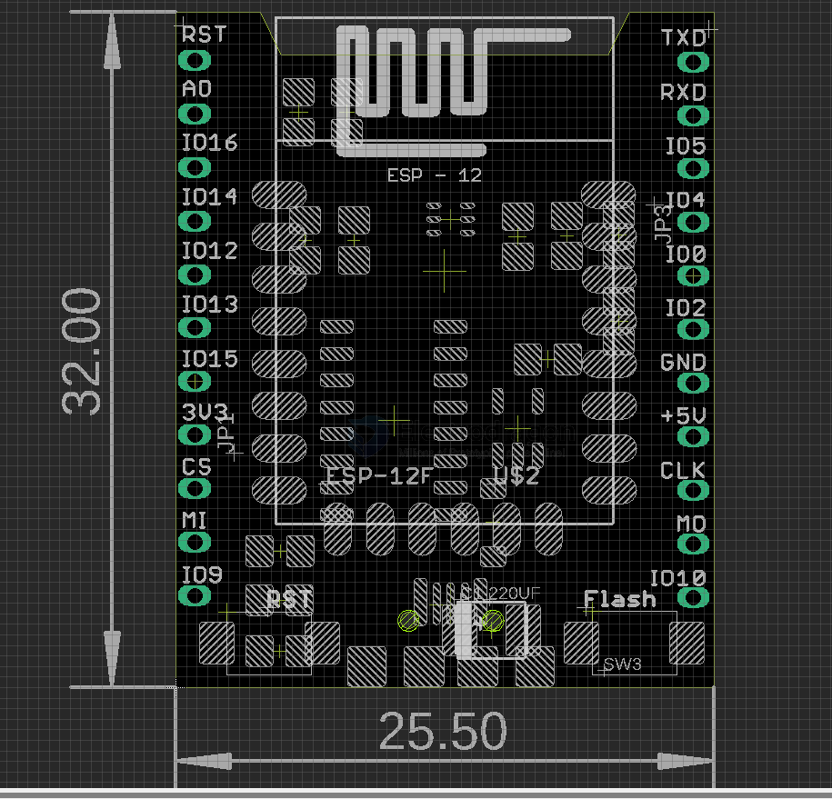

# NWI1130-dat

## Info

[product url - ESP8266 SMD Adapter Breakout Board R3](https://www.electrodragon.com/product/esp8266-smd-adapter-breakout-board-r3/)

### Board Map, Dimension, Pins, chip info, Use Guide, Setup Jumper, etc.

- support auto flashing and Reset 

## Applications, category, tags, etc. 

- [[ESP8266-dat]]

## ref 

- [[NWI1130]] 

- [legacy wiki page ](https://www.electrodragon.com/w/Category:ESP8266_Boards)
