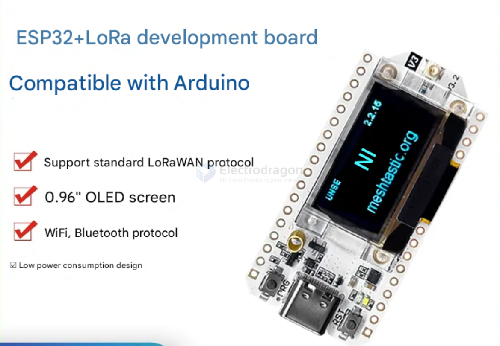
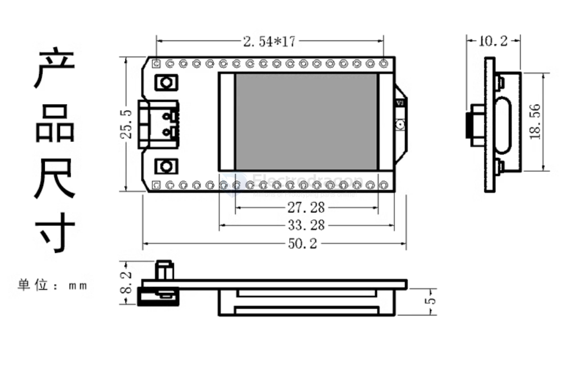
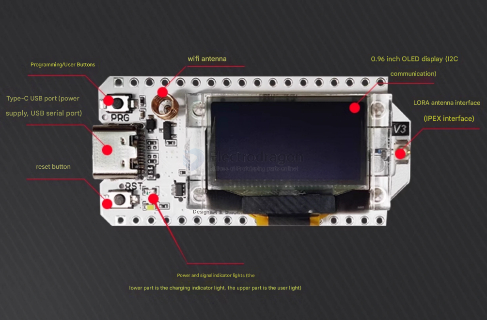
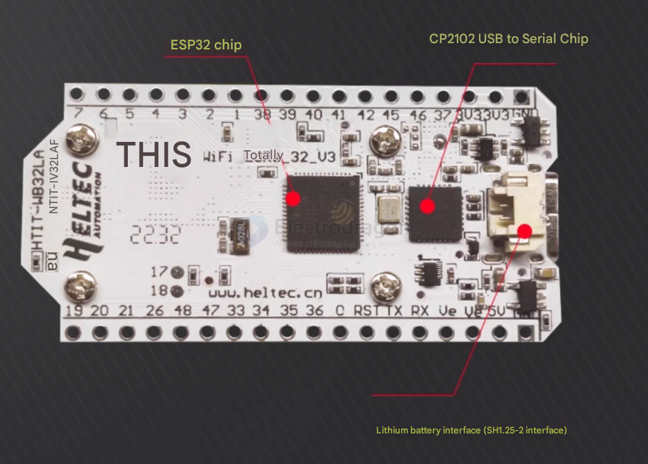

# NWI1147-dat

## Info 
 
Wifi Lora ESP32 Dev. Board [product url](https://www.electrodragon.com/product/wifi-lora-32-dev-board/)

## dimension

## Board Function map 

## Specs 

- Main frequency 240MHz
- FLASH 8M byte
- Processor Xtensa 32-bit LX7 dual-core processor
- Main control chip ESP32-S3FN8
- LoRa chip SX1262
- Deep sleep <10uA
- Open communication distance 2.8KM
- USB interface chip Cp2102
- Dual-mode Bluetooth Traditional Bluetooth and BLE low-power Bluetooth
- Development environment Perfect support for Arduino
- Working voltage 3.3~7V
- Working temperature range -20~70℃
- Receiver sensitivity -139dbm (Sf12,125KHz)
- Support mode WIFI Bluetooth LORA

## ref 

- [github code](https://github.com/Heltec-Aaron-Lee/WiFi_Kit_series)

- [[lora-dat]] - [[ESP32-dat]] - [[oled-dat]] - [[SX1262-dat]] - [[loraWan-dat]]

- [[NWI1147]]