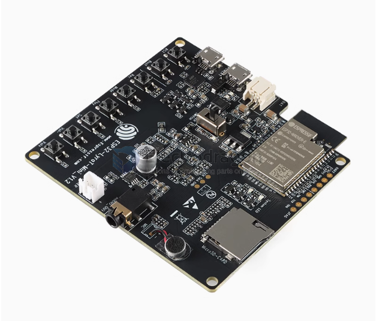

# NWI1180-dat

## esp32-lyraT
- Support multiple audio source inputs: Wi-Fi, Bluetooth audio, AirPlay, DLNA, line-in, etc.

- Dual microphone pickup, can develop near-field and far-field voice recognition

- Support various mainstream lossless audio formats: ALAC, AAC, FLAC, OPUS, MP3, WAV, OGG, etc.

- Complete wireless standards - Wi-Fi 802.11b/g/n, Classic BT, BLE

- Support multiple network configurations: BLE network configuration, Airkiss network configuration, etc.

- Rich peripheral interfaces: wired network port, touch button, TFT screen, Camera interface, etc., strong scalability, convenient product differentiation

https://www.espressif.com/sites/default/files/documentation/esp32-lyrat_user_guide_cn.pdf

## ESP32-Lyra Mini 

