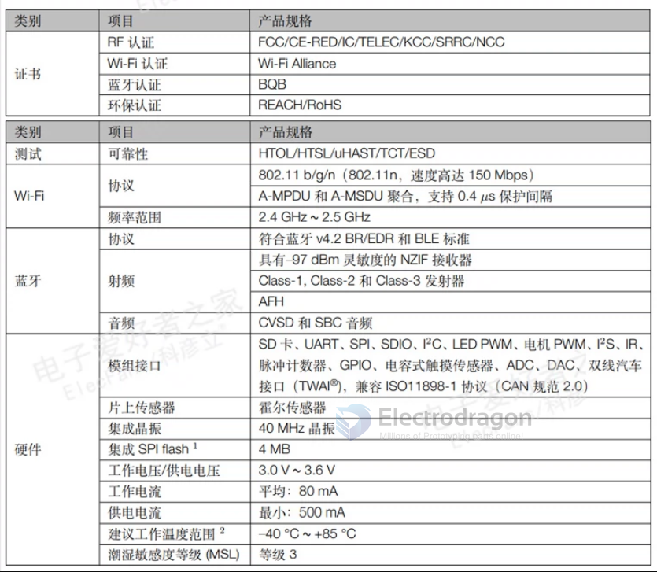
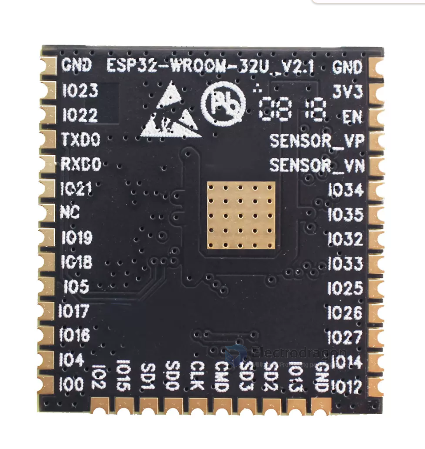
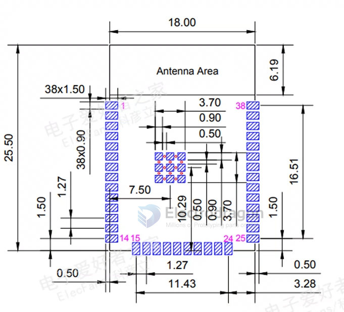

# NWI1197-dat 

- [[ESP32-dat]] - [[ESP32-modules-dat]] - [[ESP32-WROOM-dat]]

- [[NWI1194-dat]] - [[NWI1195-dat]] - [[NWI1155-dat]] - [[NWI1110-dat]]

- [[NWI1157-dat]] - [[NWI1196-dat]] - [[NWI1197-dat]]

[ESP-WROOM-32, ESP32 WIFI+BT+BLE Module-ESP32-WROOM-32D](https://www.electrodragon.com/product/wroom-32/)

ESP32-WROOM-32U - 16MB = 128Mbit

- [[ESP32-WROOM-DAT]]

## ref 

- [[NWI1197]]