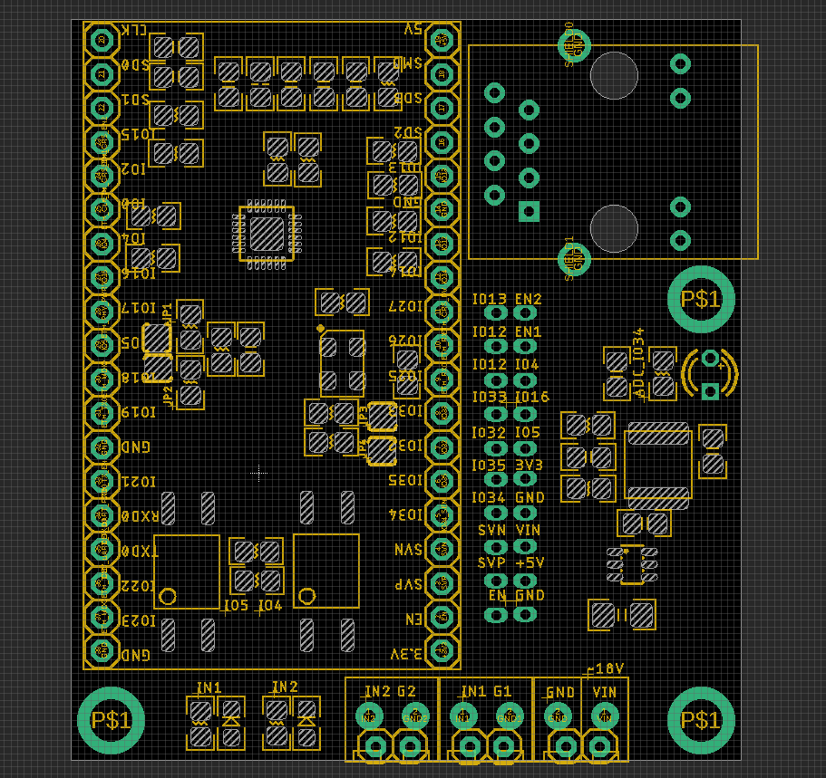
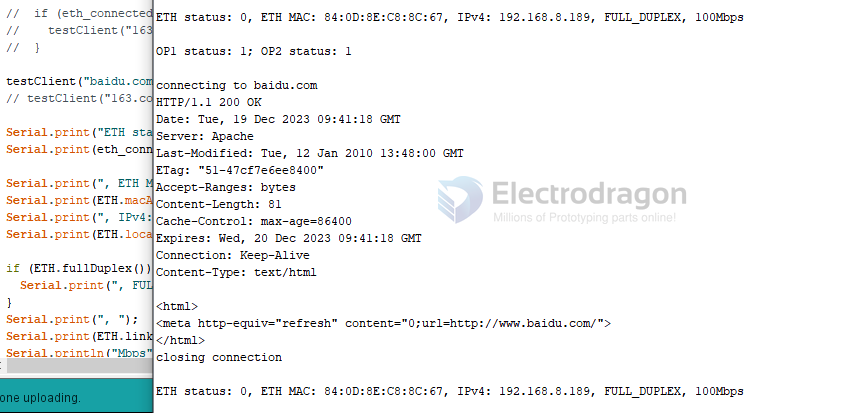
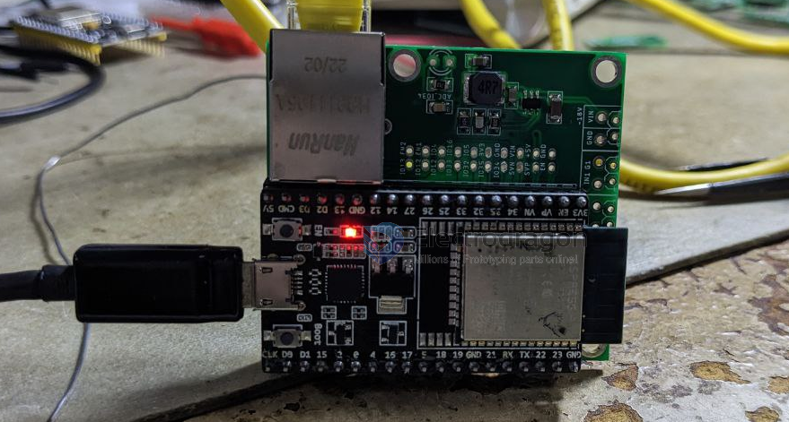

# NWI1200 DAT

To the board version V1 - [[NWI1199-DAT]]

### Hardware

- Optical Coupler IN1 = IO4, IN2 = IO5

- ADC Sensor Input IO34

### Ethernet LAN8720

- Crystal control pin IO2

- [[LAN8720-DAT]]

## ESP32 Pin Mapping

| ESP32  | func        | LAN8720             | Note         |
| ------ | ----------- | ------------------- | ------------ |
| GPIO17 | PHY_POWER   | NC - Osc. Enable    | 4k7 Pulldown |
| GPIO22 | EMAC_TXD1   | TX1                 |              |
| GPIO19 | EMAC_TXD0   | TX0                 |              |
| GPIO21 | EMAC_TX_EN  | TX_EN               |              |
| GPIO26 | EMAC_RXD1   | RX1                 |              |
| GPIO25 | EMAC_RXD0   | RX0                 |              |
| GPIO27 | EMAC_RX_DV  | CRS                 |              |
| GPIO00 | EMAC_TX_CLK | nINT/REFCLK (50MHz) | 4k7 Pullup   |
| GPIO23 | SMI_MDC     | MDC                 |              |
| GPIO18 | SMI_MDIO    | MDIO                |              |
| GND    |             | GND                 |              |
| 3V3    |             | VCC                 |              |

## Jumper Setup

| Jumpers | func                      | Set to      | Set Default | Note         |
| ------- | ------------------------- | ----------- | ----------- | ------------ |
| JP1     | CLK                       | IO0         | enable      |              |
| JP2     | REFCLKO                   | pull up     | -           |              |
| JP3     | crystal                   | pull down   | -           |              |
| JP4     | crystal                   | IO17        | -           |              |
| JP5     | crystal enable control by | IO2 or IO15 | Set to IO2         | pcb backside |

- please just use default

## reference setup

- ETH_CLOCK_GPIO0_IN - default: external clock from crystal oscillator
- ETH_CLOCK_GPIO0_OUT - 50MHz clock from internal APLL output on GPIO0 - possibly an inverter is needed for LAN8720
- ETH_CLOCK_GPIO16_OUT - 50MHz clock from internal APLL output on GPIO16 - possibly an inverter is needed for LAN8720
- ETH_CLOCK_GPIO17_OUT - 50MHz clock from internal APLL inverted output on GPIO17 - tested with LAN8720

## arduino demo output

based on demo code NWI1200-3

    OP1 status: 0; OP2 status: 0

    connecting to 163.com
    HTTP/1.1 301 Moved Permanently
    Server: nginx
    Date: Tue, 19 Sep 2023 09:22:02 GMT
    Content-Type: text/html
    Content-Length: 178
    Connection: keep-alive
    Location: http://www.163.com/

    <html>
    <head><title>301 Moved Permanently</title></head>
    <body bgcolor="white">
    
<h1>301 Moved Permanently</h1>

    

nginx

    </body>
    </html>
    closing connection

    ETH status: 0, ETH MAC: 84:0D:8E:C8:8C:67, IPv4: 192.168.1.173, FULL_DUPLEX, 100Mbps

## demo code find at

- [[arduino-code-v2]]

## ref

- [[NWI1200]]
