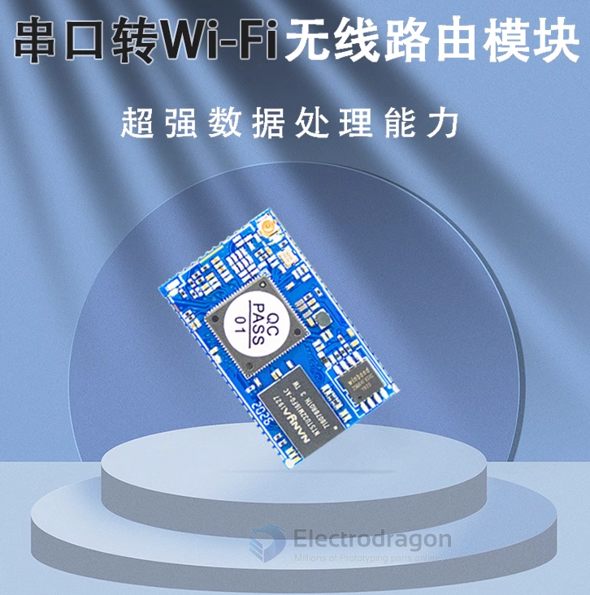
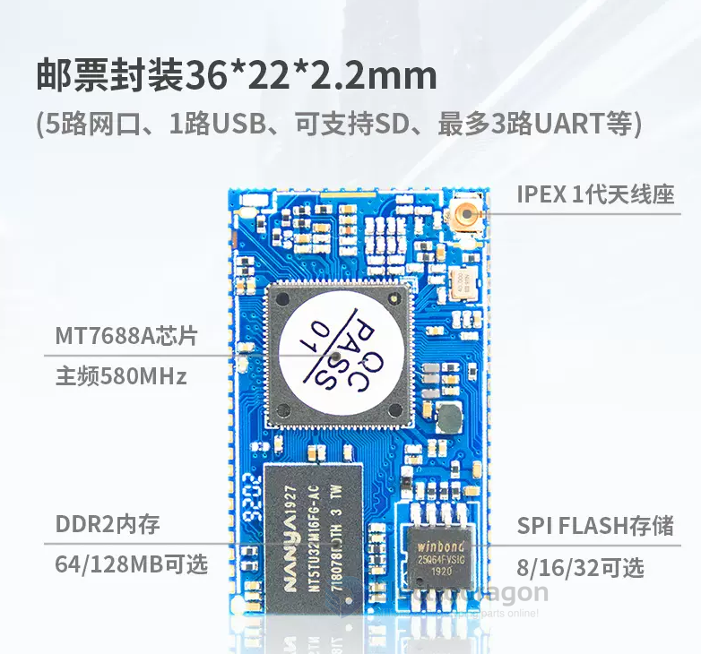

# NWI1219-V2-dat.md

## 2.4G WIFI 

- 2.4GHz wireless:
- 2.4GHz/150Mbps 1T1R;
- Support 802.11 b/g;HT 802.11n mode;
- 20/40 channel bandwidth;
- Support 802.11v;
- Support AP, STA and AP, STA mixed mode;
- Supports multiple encryption methods WEP64/128, TKIP, AES,

## Functions 

- Super data processing capability, MCU main frequency reaches 580MHz;
- 5 10/100M adaptive network ports;
- 1 USB2.0 host interface;
- Multiple interfaces SPI/SD-XC/eMMC;
- Rich peripheral interfaces I2C, I2S, UART, GPIO, USB;
- Built-in powerful PMU;
- Support QoS, WMM, WMM-PS;
- Widely used in the Internet of Things;
- Supports OpenWrt version 21.02, which can be used for secondary development by customers.

## Images 

