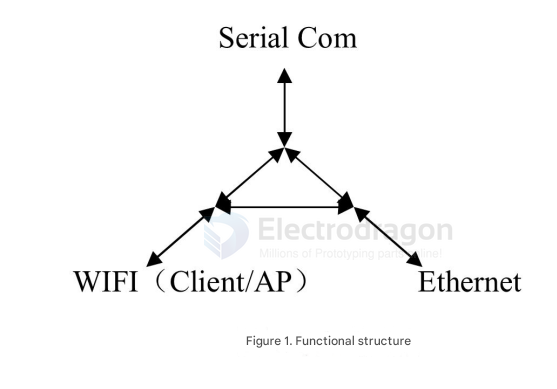
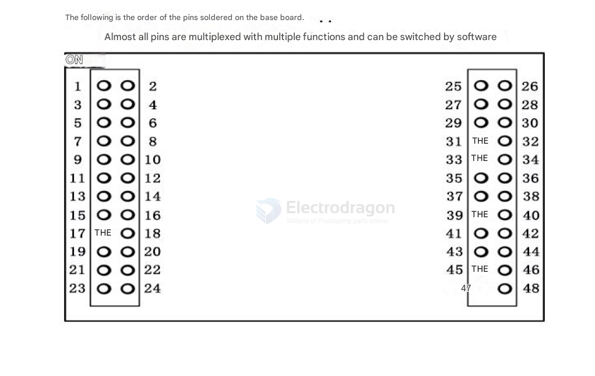

# NWI1219-dat

legacy wiki page - https://w.electrodragon.com/w/WY7688

- [[MT7688-dat]] - [[openwrt-dat]]

This product is a network-standard embedded module based on a universal serial interface, with a built-in TCP/IP protocol stack. It enables conversion between user serial port, Ethernet, and wireless network (WiFi) interfaces.

With the WYA-7688A module, traditional serial devices can transmit their data over the Internet without any configuration changes, providing users with a complete and fast solution for network data transmission of serial devices.

## Function map 

## Network Standards
* Wireless Standards: IEEE802.11n, IEEE802.11g, IEEE802.11b
* Wired Standards: IEEE802.3, IEEE802.3u
* Wireless Transmission Rate:
  * 11n: up to 150Mbps
  * 11g: up to 54Mbps
  * 11b: up to 11Mbps
* Channel Number: 1~14
* Frequency Range: 2.4~2.4835GHz
* Transmit Power: 12~16dBm
* Power Supply: 3.3V or 5V
* Interfaces:
  * 2 Ethernet ports
  * 2 UART serial ports
  * 1 USB
  * IIC and IIS, etc.
* Antenna:
  * Type: External antenna (IPX connector)
* Functional Parameters:
  * WiFi Modes: Wireless NIC / Access Point / Router
  * WDS: Supports WDS wireless bridging
* Wireless Security:
  * Wireless MAC address filtering
  * Wireless security function switch
  * 64/128/152-bit WEP encryption
  * WPA-PSK/WPA2-PSK, WPA/WPA2 security mechanisms
* Network Management:
  * Remote Web management
  * Import/export configuration files
  * Web software upgrade
* Serial to Network:
  * Max transmission rate: 500000bps
  * TCP connections: max >20
  * UDP connections: max >20
  * Serial baud rate: 1200~230400bps (supports non-standard baud rates)
* Other Parameters:
  * Status indicators: Power, WiFi
* Environmental Standards:
  * Operating temperature: -20~70°C
  * Operating humidity: 10%-90% RH (non-condensing)
  * Storage temperature: -40~80°C
  * Storage humidity: 5%-90% RH (non-condensing)
* Other Features:
  * Selectable frequency bandwidth: 20MHz, 40MHz, auto

## Pinout

- 1 UART_TXD0 GPIO#12
- 2 3.3V 3.3V 供电
- 3 UART_RXD0 GPIO#13
- 4 I2S_WS I2C_SCLK GPIO#2 PCMCLK
- 5 I2S_SDO I2C_SD GPIO#1 PCMDTX
- 6 I2S_CLK I2C_SD GPIO#3 PCMFS
- 7 GPIO0 GPIO#11 REF_CLKO PERST_N
- 8 I2S_SDI I2C_SCLK GPIO#0 PCMDRX
- 9 I2C_SD GPIO#5
- 10 I2C_SCLK GPIO#4
- 11 SPI_CS1 GPIO#6 REF_CLKO
- 12 SPI_CLK GPO#7
- 13 SPI_MISO GPIO#9
- 14 SPI_CS0 GPIO#10
- 15 SPI_MOSI GPIO#8
- 16 MDI_RP_P0
- 17 MDI_RN_P0
- 18 MDI_TP_P0
- 19 MDI_TN_P0
- 20 MDI_TP_P1 SPIS_CS GPIO#14 PWM_CH0
- 21 MDI_TN_P1 SPIS_CLK GPIO#15 PWM_CH1
- 22 MDI_RP_P1 SPIS_MISO GPIO#16 UART_TXD2
- 23 MDI_RN_P1 SPIS_MOSI GPIO#17 UART_RXD2
- 24 VDD_FLASH Flash 编程 电压
- 25 5.0V 5.0V 供电
- 26 GND 电源地
- 27 UART_TXD1 GPIO#45
- 28 PERST_N GPIO#36
- 29 UART_RXD1 GPIO#46
- 30 WDT_RST_N GPO#37
- 31 REF_CLKO GPIO#38
- 32 EPH_LED1_N GPIO#33
- 33 WLED_N GPIO#35
- 34 EPH_LED0_N GPIO#34
- 35 SD_D0 MDI_RN_P3 GPIO#25
- 36 SD_CLK MDI_RP_P4 GPIO#26
- 37 SD_D1 MDI_RP_P3 GPIO#24
- 38 SD_CD MDI_TN_P3 GPIO#23
- 39 SD_WP MDI_TP_P3 GPIO#22
- 40 SD_D3 MDI_TP_P4 GPIO#29
- 41 SD_D2 MDI_TN_P4 GPIO#27
- 42 SD_CMD MDI_RN_P4 GPIO#28
- 43 PWM_CH1 MDI_RN_P2 GPIO#19
- 44 PWM_CH0 MDI_RP_P2 GPIO#18
- 45 USB_DP
- 46 UART_TXD2 MDI_TP_P2 GPIO#20 PWM_CH2
- 47 USB_DM
- 48 UART_RXD2 MDI_TN_P2 GPIO#21 PWM_CH3
- 47 USB_DM
- 48 UART_RXD2 MDI_TN_P2 GPIO#21 PWM_CH3

## ref 

- [[NWI1219]]