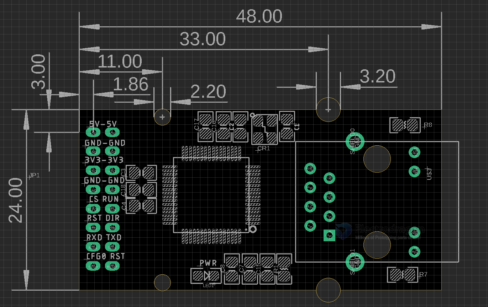

# NWI1223 Serial UART to Ethernet TCP UDP Module

- legacy wiki page: https://w.electrodragon.com/w/SER-NET
- software: https://github.com/Edragon/WCH_SER-NET

## Note: 
- close PC firewall in case 
- make sure the target IP address is to your target, for example your PC

## setup and demo video 

https://www.youtube.com/watch?v=dOoPNtahNfw&ab_channel=Electrodragon

## ref 

- [[ethernet-dat]]

- [[NWI1223]]
