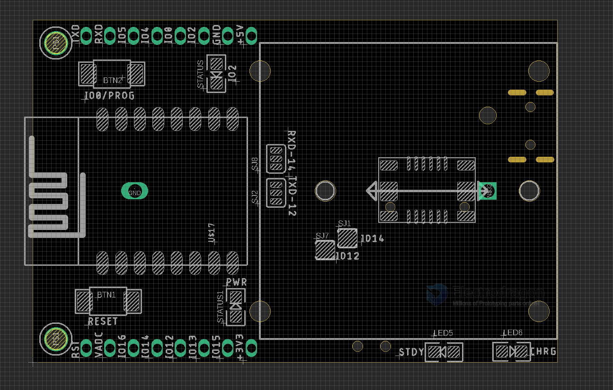
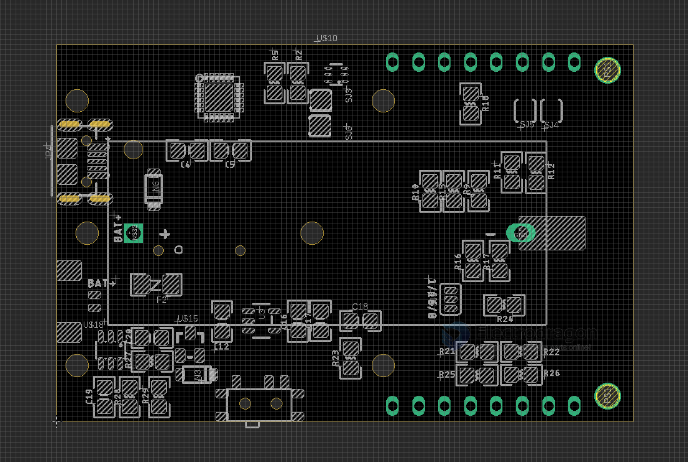

# NWI1230-dat

[ESP8266 Mini-Dev BTB Platform Board](https://www.electrodragon.com/product/esp8266-mini-dev-platform-board/)

board width = 37 mm

- [[BTB-dat]] - [[12P-BTB-dat]]

## on board resources 

- IO2 on module LED 
- on board battery charger 
- on board [[auto-serial-dat]]
- auto manage [[Power-distribution-dat]] circuits 
- [[serial-dat]] chip [[CP2104-dat]]

## BTB Concave connector 

| L-pin | R-pin   |
| ----- | ------- |
| I016  | ESP_RXD |
| I014  | EXP_TXD |
| I012  | IO5     |
| I013  | IO4     |
| +5V   | IO15    |
| 3V3   | GND     |

[You can find more usage images here.](https://www.electrodragon.com/portfolio/stackable-mod-and-base-mb-series/)

[Detailed use guide here.](https://www.electrodragon.com/w/Category:ED_Platform)

File:Esp8266_esp-link_base_board.gif

Reserved resistor connection IO16-RST

- [[battery-dat]] - [[CR123-dat]]

## ref 

- [[ESP8266-dat]]

- [[BTB-dat]] - [[NWI1230]]