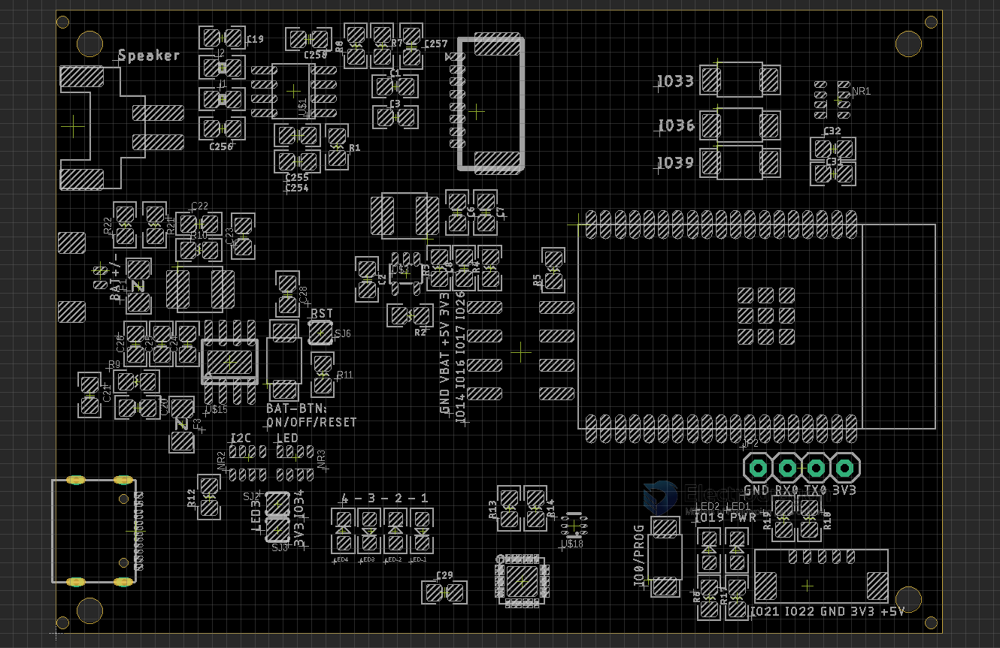
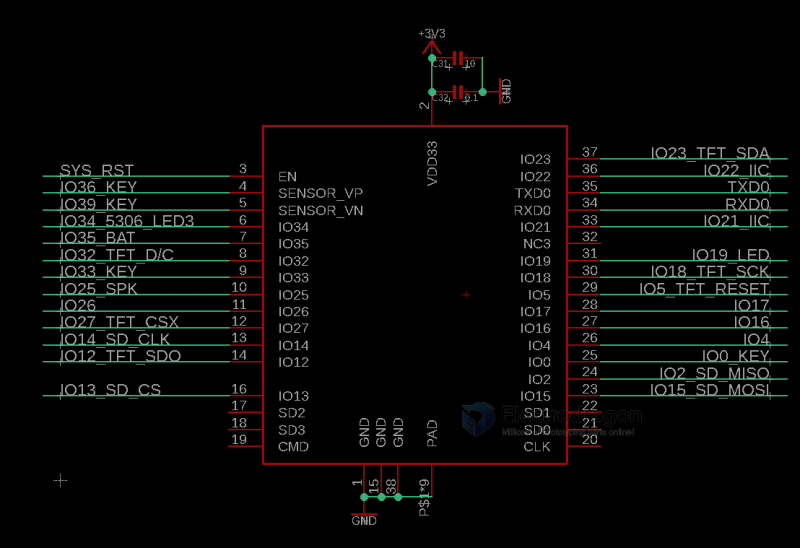
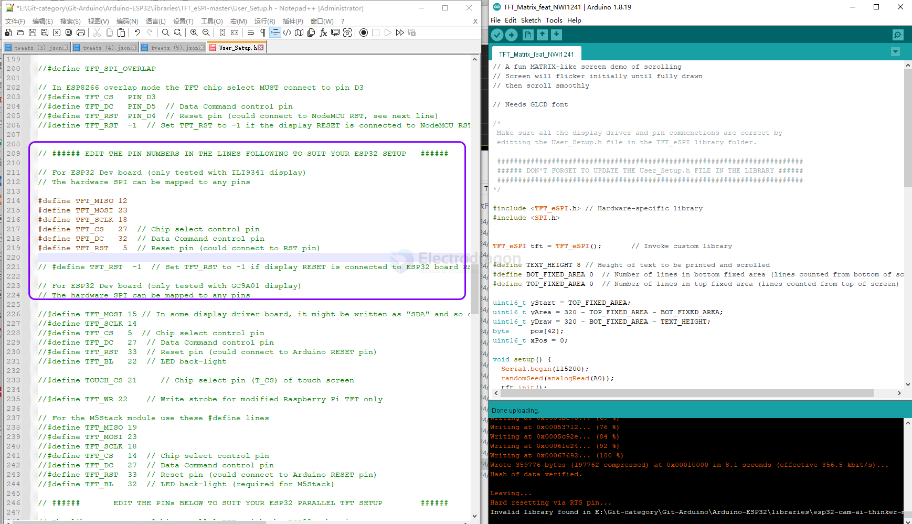

# NWI1241-dat

## Board map 

### Pin Definitions of Extra Pins

#### battery charger

Jumper - SJ6 - [[battery-charger-dat]]

- reset of IP5306 together with ESP32 

Network Resistor NR2 / NR3
- default set for battery volume, indicating by on board LEDs
- NR2 + SJ2 + SJ3 for IP5306-I2C version only, customize only 

#### MISC 

Extra Pin Header Pins: 

* GND VBAT +5V +3V3
* IO4 IO16 IO17 IO26

I2C Port - [[I2C-dat]]

* IO21 IO22 GND 3V3 +5V

#### USB 

- [[Serial-dat]] - [[type-c-dat]]

#### Interactive LCD and audio 

- [[SPI-LCD-dat]]

- [[audio-dat]]

Buttons 
- programmerable: IO33 IO36 IO 39

### Define in arduino 

    #define button1 IO39 
    #define button2 IO36 
    #define button3 IO33
    #define button4 IO0

    #define led1 IO19

    #define SPK IO25

    #define TFT_RESET IO5
    #define TFT_SCK IO18
    #define TFT_DC IO32
    #define TFT_CS IO27
    #define TFT_SDA IO23
    #define TFT_SDO IO12

    #define SD_CS IO13
    #define SD_MOSI IO15
    #define SD_MOSI IO14
    #define SD_MISO IO2

    #define IP5306_SCL IO22
    #define IP5306_SDA IO21
    #define IP5306_LED3 IO34

    #define BAT_ADC IO35

Define in [[ESP32-WROVER-dat]] module 

New version define in the file User_Setup.h

## Arduino Demo Code

* Based on Arduino TFT_eSPI library
* Add extra pin definitions, demo code please see [here](https://github.com/Edragon/Arduino-ESP32) (Arduino-ESP32/Sketchbook/Display/).

* Working demo please search [[contact-dat]] channels

- https://github.com/Bodmer/TFT_eSPI

## Demo 

- https://t.me/electrodragon3/156

## Notice

* Please attach battery, and plug USB to "activate" battery first, once you removed the battery you may need to activate it again
* Battery port, I2C port pitch 1.25 mm, speaker port pitch 2.0mm

## ref 

- [[NWI1241]]

- Module - [[ESP32-WROVER-dat]]

- [[memory-dat]] - [[sd-dat]] - [[I2C-dat]]

- [[audio-dat]] - [[amplifier-dat]] - [[NS4150-dat]] - [[ESP32-dac-dat]] - [[wav-dat]]

- [[battery-charger-dat]] - [[IP5306-dat]]