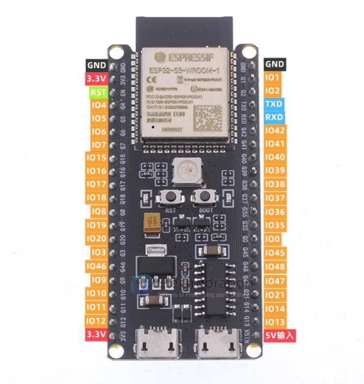
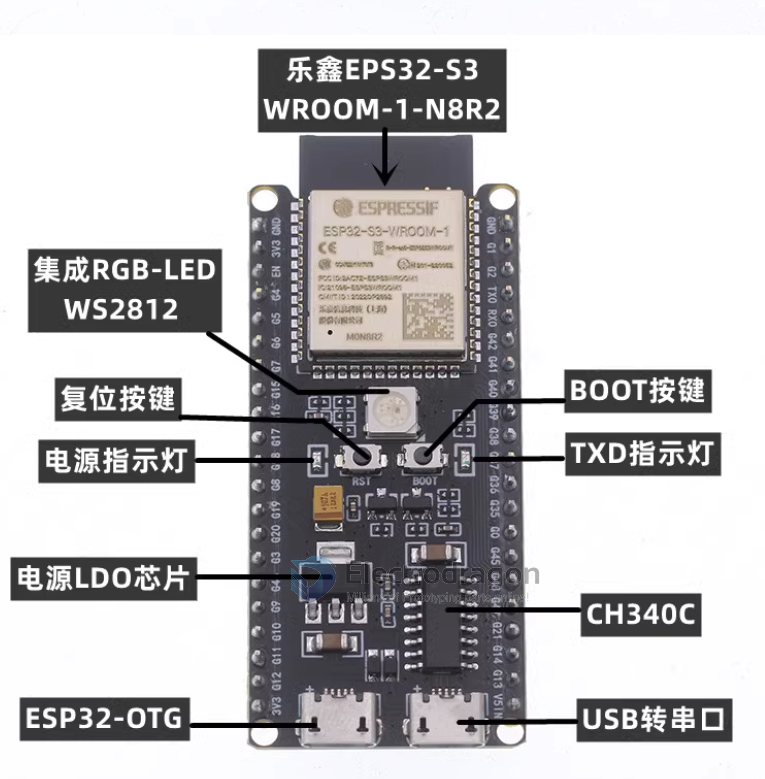
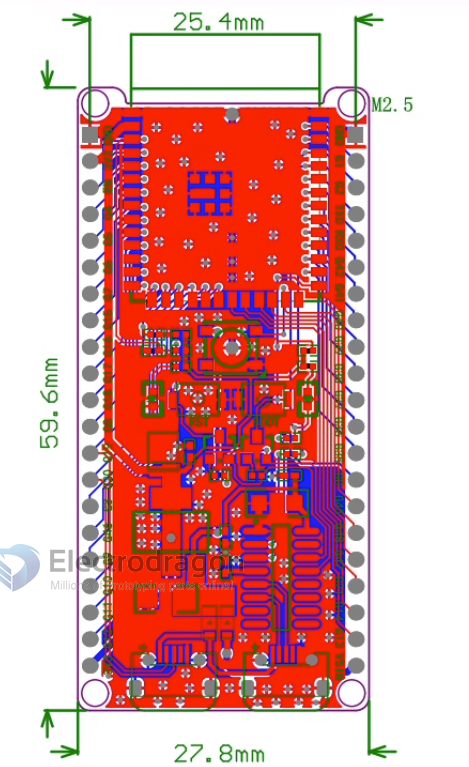

# NWI1243-dat

[ESP32-S3 Development Board, Dual USB, Wifi + BLE5](https://www.electrodragon.com/product/esp32-s3-development-board-dual-usb-wifi-ble5/)

- main module ESP32-S3-WROOM-1-N8R2 = [[ESP32-S3-WROOM-1]]

- pins = 2x21 = 42 pins 
- available GPIOs = 42 - 6 = 36 pins 

- schematic see here: [[ESP32-S3-Board-DAT]]

## ref 

- [[ESP32-S3-dat]] - [[NWI1243]]