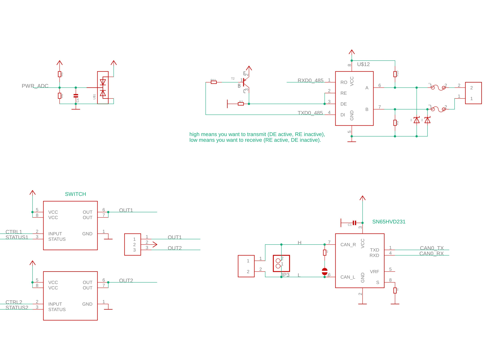
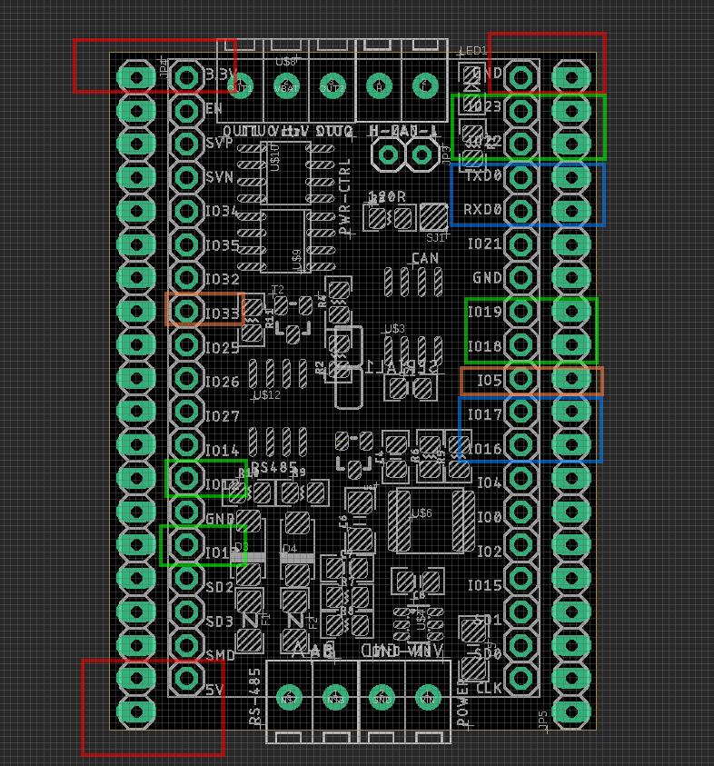
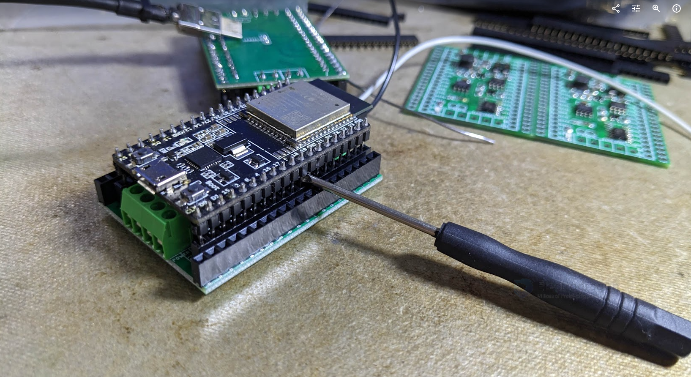

# NWI1245 DAT

https://www.electrodragon.com/product/esp32-can-rs-485-wire-interface-shield/

## Main functions:
- general load switching - [[high-side-driver-dat]]
  - current driving capability is ~ 36V 5A

- RS485 communication - [[rs485-dat]]
- CAN communication - [[can-dat]]
- DC-DC buck regulator - 8201 in [[dcdc-dat]]
- ESP32 core control - stack dev boards in [[ESP32-dat]]

## Used ESP32-DevKitC Pins

- [[NWI1100-dat]] - [[NWI1206-dat]]

UART2 (CAN UART)
- IO23 = CAN0_TX
- IO22 = CAN0_RX

UART1 (RS485)
- IO17 = TXD1 
- IO16 = RXD1

UART0 (default used by USB-TTL bridge chip)
- TXD0 = TXD0
- RXD0 = RXD0 

MISC
- IO33 = Power_ADC
- IO5 = LED

General load switching 
- please note one chip is not soldering default in case you don't need two to save cost
- try IO12 or IO19
- VBAT pin up to 36V, and OUTA or OUTB will be on/off when you digitalWrite it high or low
  - IO12 = CTRL1
  - IO19 = CTRL2 
  - IO13 = STATUS1
  - IO18 = STATUS2

| L_assigned | left | right | R_assigned  |
| ---------- | ---- | ----- | ----------- |
|            | en   | 23    | TXD2 (can)  |
|            | 36   | 22    | RXD2 (can)  |
|            | 39   | TXD0  | TXD0 (USB)  |
|            | 34   | RXD0  | RXD0  (USB) |
|            | 35   | 21    |             |
|            | 32   | gnd   |             |
| Power_ADC  | 33   | 19    | CTRL2       |
|            | 25   | 18    | STATUS2     |
|            | 26   | 5     | LED (prog)  |
|            | 27   | 17    | TXD1 (485)  |
|            | 14   | 16    | RXD1 (485)  |
| CTRL1      | 12   | 4     |             |
|            | gnd  | 0     |             |
| STATUS1    | 13   | 2     |             |
|            | 9    | 15    |             |
|            | 10   | 8     |             |
|            | 11   | 7     |             |
|            | +5V  | 6     |             |

## Schematic of peripherals

## Dimension and pin definitions 

- Red pins for power supply 
- blue pins for serial interfaces
- green pins IO22/IO23 for CAN BUS
- the rest green pins and orange pins for power switch controls 

- back side selector for UART-0-main or UART1-alternative

## removing tips 

- use a small driver to leverage in the between carefully 

## demo 

- function test method: https://www.youtube.com/shorts/vkFrkTkw5Ak
- demo code look into our [[arduino-dat]] - [[git-dat]]

- https://www.youtube.com/shorts/TeaZ1xKcAqg

- tested work with [[DPR1103-dat]]

## Update logs 

V1.11
- notice boards are using new [[KF2EDG-dat]] connector from 2024 Aug.
- add one power supply indicator led 

## ref
- code please refer to our ESP32 arduino github repository 
- https://github.com/Edragon/Arduino-ESP32/tree/master/BSP/NWI1245/power-switch-test
- https://github.com/Edragon/Arduino-ESP32
- https://github.com/Edragon/Arduino-ESP32/blob/master/Sketchbook/interface/RS485-1/RS485-1.ino

- [[RS485-dat]] - [[CAN-dat]] - [[high-side-driver-dat]]

- [[voltage-divider-dat]] - [[conn-cable-terminal-dat]]

- [[qc-dat]]

- [[NWI1245]] - [[NWI1245-QC-log-dat]]