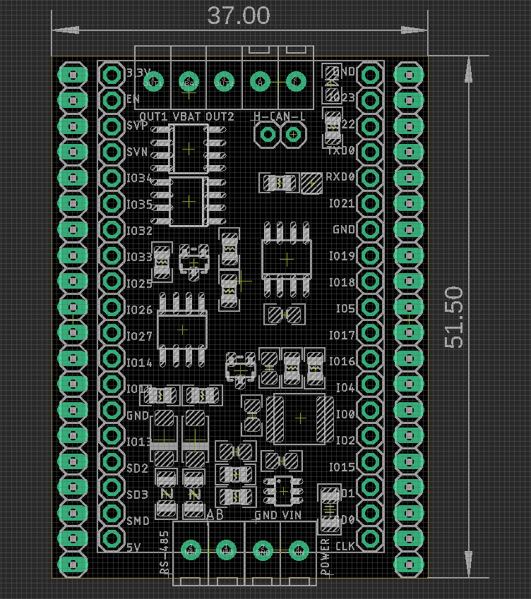

# NWI1245 DAT

https://www.electrodragon.com/product/esp32-can-rs-485-wire-interface-shield/

## Main functions:
- general load switching - [[high-side-driver-dat]]
  - current driving capability is ~ 36V 5A

- RS485 communication
- CAN communication 

## Used ESP32-DevKitC Pins

- CAN UART
  - IO23 = CAN0_TX
  - IO22 = CAN0_RX

- UART1
  - IO17 = TXD1 
  - IO16 = RXD1

- UART0 (default used by USB-TTL bridge chip)
  - TXD0 = TXD0
  - RXD0 = RXD0 

- IO33 = Power_ADC
- IO5 = LED

- general load switching 
  - IO12 = CTRL1
  - IO19 = CTRL2 - chip is not soldered by default 
  - IO13 = STATUS1

  - IO18 = STATUS2

## Schematic of peripherals

## Dimension and pin definitions 

- back side selector for UARTs

## power supply
- [[DCDC1]] - [[NWI1245]]

## ref
- code please refer to our ESP32 arduino github repository 
- [[RS485-dat]] - [[CAN-dat]] - [[high-side-driver-dat]]

