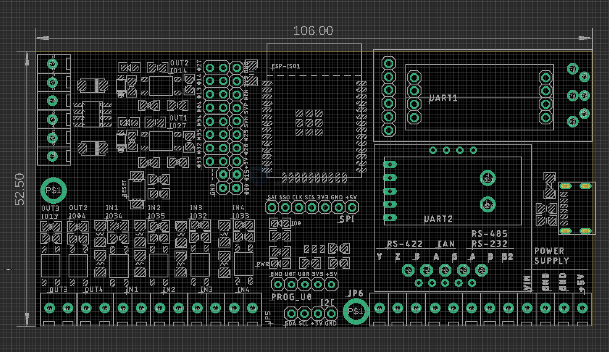

# NWI1248 DAT

## Board map 

## check list 

### Interface

[[RS485-DAT]]
- use breakout board [[MSP1076-dat]], switch breakout board's direction to change input or output direction
- reversal direction as breakout boards, solder on the main board 
- 8 channels IOs directly from ESP32 to isolator, later V2 version use IO expander instead. 
  
[[RS232-DAT]]
- use breakout board [[DPR1084-DAT]]

### Opto-coupler IO channels 

#### output with mosfet driver 

- IO14 
- IO27 

#### direct output 

- IO13
- IO04

#### direct input 

- IO34 
- IO35 
- IO32 
- IO33

### power supply 

- upgrade to [[MP1584-DAT]], ~28V 3A

- up to 18V 2A, similar to [[NWI1245-DAT]]
