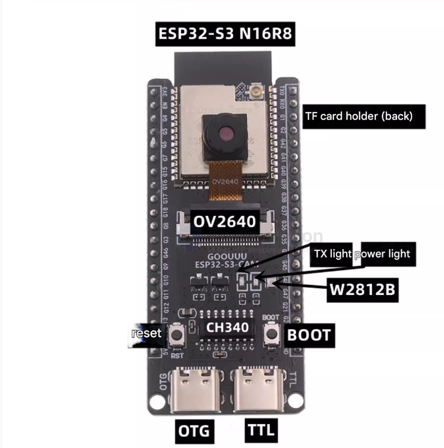
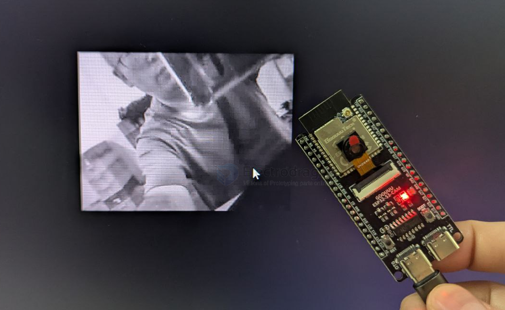
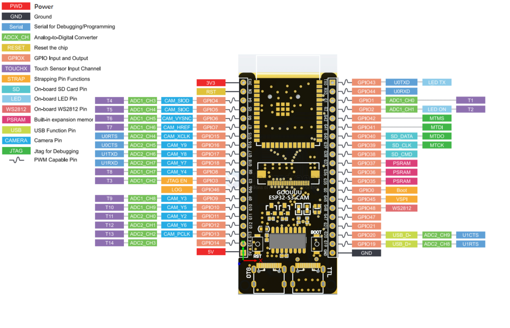
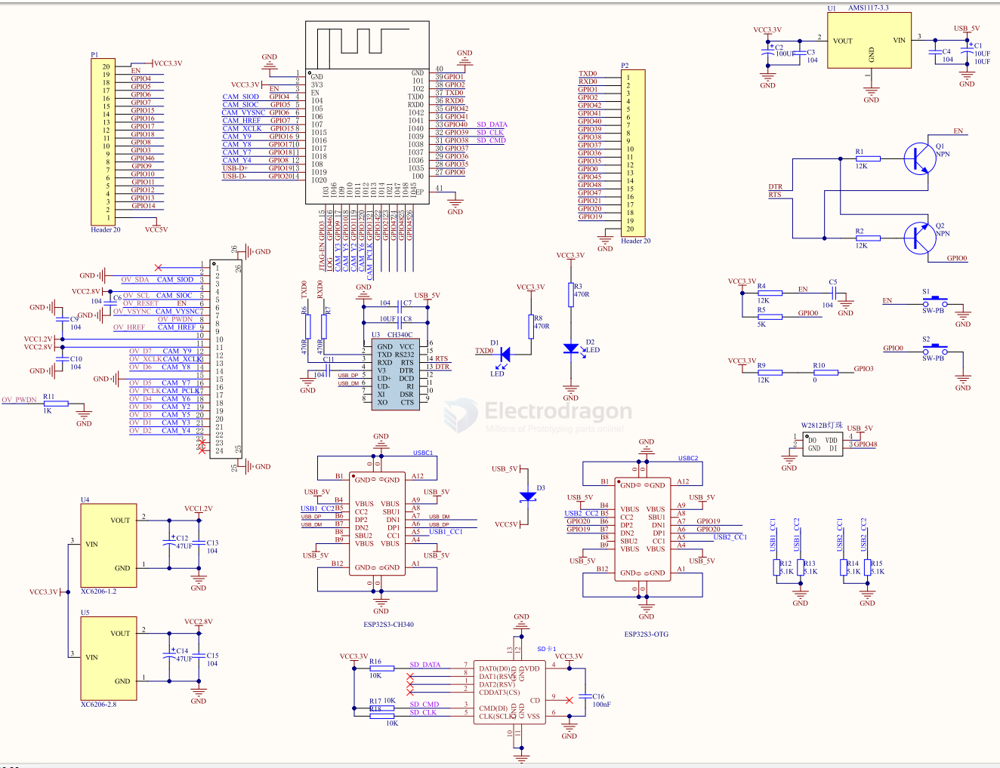
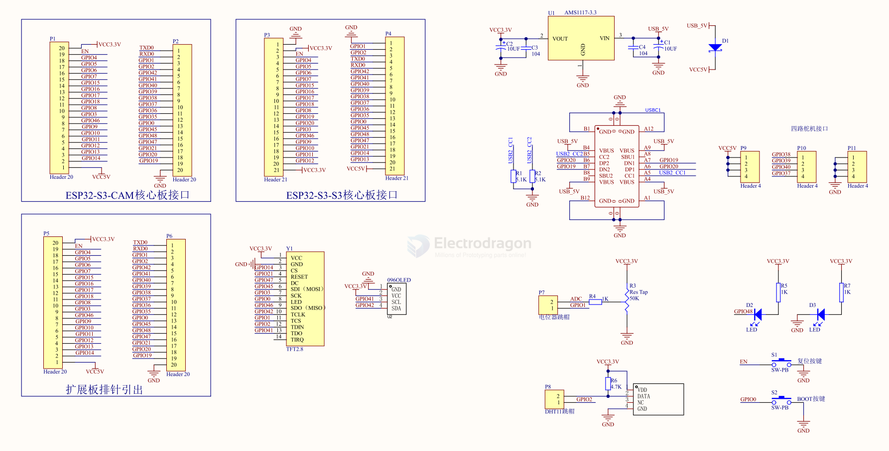

# NWI1249-dat

ESP32-S3-cam-dat - [[ESP32-S3-dat]]

- [[camera-sdk-dat]] - [[camera-dat]] - [[OV2640-dat]]

- [[ESP32-SDK-dat]] - [[serial-dat]]

- [[peripherals-dat]]

## board functions and demo 






## pin map 



board left side 

| touch | Pin Name | Function  | Signal     |
| ----- | -------- | --------- | ---------- |
|       |          | 3V3       | Power 3.3V |
|       |          | RST       | Reset      |
| T4    | ADC1_CH3 | CAM_SIOD  | GPIO4      |
| T5    | ADC1_CH4 | CAM_SIOC  | GPIO5      |
| T6    | ADC1_CH5 | CAM_VSYNC | GPIO6      |
| T7    | ADC1_CH6 | CAM_HREF  | GPIO7      |
| UORTS | ADC2_CH4 | CAM_XCLK  | GPIO15     |
| UOCTS | ADC2_CH5 | CAM_Y9    | GPIO16     |
| U1TXD | ADC2_CH6 | CAM_Y8    | GPIO17     |
| U1RXD | ADC2_CH7 | CAM_Y7    | GPIO18     |
| T8    | ADC1_CH7 | CAM_Y4    | GPIO8      |
| T3    | ADC1_CH2 | JTAG_EN   | GPIO3      |
|       |          | LOG       | GPIO46     |
| T9    | ADC1_CH8 | CAM_Y3    | GPIO9      |
| T10   | ADC1_CH9 | CAM_Y5    | GPIO10     |
| T11   | ADC2_CH0 | CAM_Y2    | GPIO11     |
| T12   | ADC2_CH1 | CAM_Y6    | GPIO12     |
| T13   | ADC2_CH2 | CAM_PCLK  | GPIO13     |
| T14   | ADC2_CH3 |           | GPIO14     |
|       |          | 5V        | Power 5V   |


board right side 

| singal | function | pin name | touch |
| ------ | -------- | -------- | ----- |
| GPIO43 | UOTXD    | LED TX   |       |
| GPIO44 | UORXD    |          |       |
| GPIO1  | ADC1_CH0 |          | T1    |
| GPIO2  | ADC1_CH1 | LED ON   | T2    |
| GPIO42 |          | MTMS     |       |
| GPIO41 |          | MTDI     |       |
| GPIO40 | SD_DATA  | MTDO     |       |
| GPIO39 | SD_CLK   | MTCK     |       |
| GPIO38 | SD_CMD   |          |       |
| GPIO37 | PSRAM    |          |       |
| GPIO36 | PSRAM    |          |       |
| GPIO35 | PSRAM    |          |       |
| GPIO34 | Boot     |          |       |
| GPIO45 | VSPI     |          |       |
| GPIO48 | WS2812   |          |       |
| GPIO47 |          |          |       |
| GPIO21 |          |          |       |
| GPIO20 | USB_D-   | ADC2_CH9 | UCTS  |
| GPIO19 | USB_D+   | ADC2_CH8 | URTS  |
| GND    |          |          |       |


## miropython setup 

== esp32s3-freenove

```
esp32-s3 = {
    PIN_PWDN: -1,
    PIN_RESET: -1,
    PIN_XCLK: 15,      # CAM_XCLK: GPIO15
    PIN_SIOD: 4,       # CAM_SIOD: GPIO4
    PIN_SIOC: 5,       # CAM_SIOC: GPIO5
    PIN_D7: 16
    PIN_D6: 17
    PIN_D5: 18
    PIN_D4: 12
    PIN_D3: 10
    PIN_D2: 8
    PIN_D1: 9
    PIN_D0: 11
    PIN_VSYNC: 6,      # CAM_VSYNC: GPIO6
    PIN_HREF: 7,       # CAM_HREF: GPIO7
    PIN_PCLK: 13,      # CAM_PCLK: GPIO13
    XCLK_MHZ: 12,
    PIXFORMAT: 5,
    FRAMESIZE: 10,
    JPEG_QUALITY: 10,
    FB_COUNT: 1,
}
```


## SCH 



- GPIO 3 == pull-up 
- GPIO 35 == LED 
- EN == button, pull-up, filter-cap 
- IO0 == button, pull-up

- [[SD-dat]]

## Extension board SCH 



extension board V2 

- [[SX1308-dat]] - [[LCD-dat]] - [[TP4054-dat]]

- [[I2S-dat]] - [[MAX98357-dat]]


## init debug boot log 

    mode:DIO, clock div:1
    load:0x3fcd0108,len:0x15c8
    load:0x403b6000,len:0x8c8
    load:0x403ba000,len:0x2c04
    entry 0x403b61c4
    I (24boot: ESP-IDF v4.4-dev-2594-ga20df743f1-dirty 2nd stage bootloader
    I (25boot: compile time 16:57:21
    I (25boot: chip revision: 0
    I (28boot.esp32s3: SPI Speed      : 80MHz
    I (33boot.esp32s3: SPI Mode       : DIO
    I (38boot.esp32s3: SPI Flash Size : 2MB
    I (43boot: Enabling RNG early entropy source...
    W (48bootloader_random: RNG for ESP32-S3 not currently supported
    I (55boot: Partition Table:
    I (59boot: ## Label            Usage          Type ST Offset   Length
    I (66boot:  0 nvs              WiFi data        01 02 00009000 00006000
    I (73boot:  1 phy_init         RF data          01 01 0000f000 00001000
    I (81boot:  2 factory          factory app      00 00 00010000 00100000
    I (88boot: End of partition table
    I (92esp_image: segment 0: paddr=00010020 vaddr=3c020020 size=090e0h ( 37088map
    I (108esp_image: segment 1: paddr=00019108 vaddr=3fc90dd0 size=0253ch (  9532load
    I (111esp_image: segment 2: paddr=0001b64c vaddr=40374000 size=049cch ( 18892load
    I (122esp_image: segment 3: paddr=00020020 vaddr=42000020 size=1b660h (112224map
    I (147esp_image: segment 4: paddr=0003b688 vaddr=403789cc size=08404h ( 33796load
    I (154esp_image: segment 5: paddr=00043a94 vaddr=50000000 size=00010h (    16load
    I (160boot: Loaded app from partition at offset 0x10000
    I (160boot: Disabling RNG early entropy source...
    W (164bootloader_random: RNG for ESP32-S3 not currently supported
    I (182cpu_start: Pro cpu up.
    I (182cpu_start: Starting app cpu, entry point is 0x40375104
    I (0cpu_start: App cpu up.
    I (196cpu_start: Pro cpu start user code
    I (196cpu_start: cpu freq: 160000000
    I (196cpu_start: Application information:
    I (199cpu_start: Project name:     led_strip
    I (204cpu_start: App version:      1
    I (209cpu_start: Compile time:     Aug 17 2021 17:09:47
    I (215cpu_start: ELF file SHA256:  bda59acbde3f7a0e...
    I (221cpu_start: ESP-IDF:          v4.4-dev-2594-ga20df743f1-dirty
    I (228heap_init: Initializing. RAM available for dynamic allocation:
    I (235heap_init: At 3FC94220 len 0004BDE0 (303 KiB): D/IRAM
    I (241heap_init: At 3FCE0000 len 0000EE34 (59 KiB): STACK/DRAM
    I (248heap_init: At 3FCF0000 len 00008000 (32 KiB): DRAM
    I (255spi_flash: detected chip: generic
    I (259spi_flash: flash io: dio
    W (263spi_flash: Detected size(16384klarger than the size in the binary image header(2048k). Using the size in the binary image header.
    I (277cpu_start: Starting scheduler on PRO CPU.
    I (0cpu_start: Starting scheduler on APP CPU.
    I (308example: LED Rainbow Chase Start
    I (308example: USB initialization
    I (308tusb_desc: 

    ...

    I (478TinyUSB: TinyUSB Driver installed
    I (488example: USB initialization DONE
    I (1388example: log -> UART
    example: print -> stdout
    example: print -> stderr
    I (2888example: log -> UART
    example: print -> stdout
    example: print -> stderr
    I (4388example: log -> UART
    example: print -> stdout
    example: print -> stderr

## sdk 

- [[circuitpython-esp32-s3-dat]] - [[camera-sdk-dat]]


- [[ESP32-S3-cam-code-dat]]


## ref 


- [[ESP32-S3-dat]]