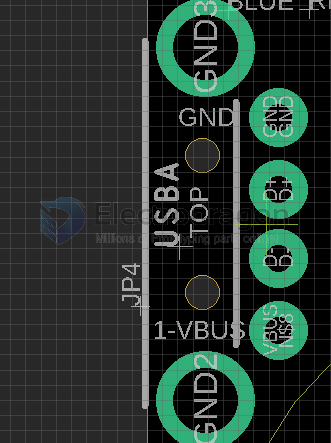
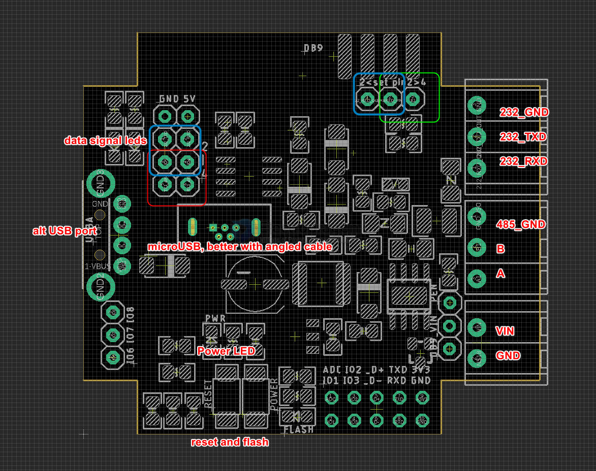
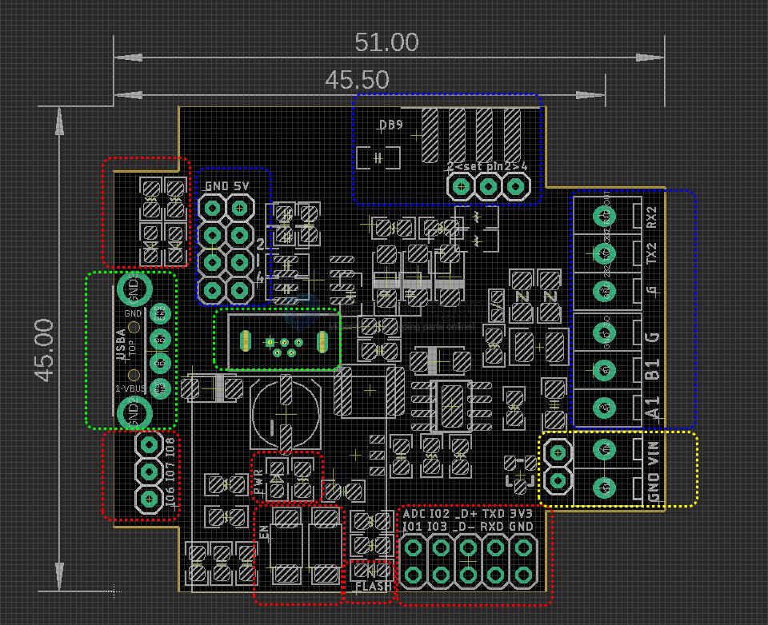

# NWI1252-dat

## usage 

### Power supply 

Wide input voltage range: 5.5V to 36V - [[dcdc-dat]]

### USB 

- Soldering wirings GND / D+ (green) / D- (white) / VUSB = [[USB-cable-dat]]

## Board maps 

### V1 

- set red and yellow jumpers for RS485
- set blue jumpers for RS232

- [[DB9-dat]]

### V0 (obseleted)

red box 
- data communication LED indicator 
- spare pins 
  - IO6 IO7 IO8 
  - ADC IO2 D+ TXD 3V3
  - IO1 IO3 D- RXD GND
- EN button and flash button = IO10
- power LED
- flash button programmable LED = IO9

yello box
- Power input 

Green Box 
- USB A native USB
- micro USB native USB, same

Blue box 
- jumper, RS232 / RS485 output selector 
- GND / +5V 
- DB9 connector, includes a jumper selector for pin2 
- cable terminal output RS232 / RS485, 

## demo vidoe 

- https://www.youtube.com/shorts/bP3zJOAH-PU
- https://www.youtube.com/shorts/yHJsV8njQ3E
- https://www.youtube.com/shorts/BCYFG2o0iMA
- https://www.youtube.com/shorts/9svPSDBRmKE

and reference demo test code - https://github.com/Edragon/Arduino-ESP32/tree/master/NWI/NWI1252

## Note 

- Case is super rigid, very difficult to open it, use a sharp tool to pry it

## Design logs

| updates                            | status    | version |
| ---------------------------------- | --------- | ------- |
| simutaniously RS-232 / RS-485 data | added     | V2      |
| flipped side DB-9                  | added     | V2      |
| power reverse protection           | added     | V1      |
| DC barrel 2.1mm barrel plug        | not added | V1      |

## ref 

- [[arduino-dat]] - [[ESP32-C3-dat]] - [[ESP32-C3-USB-dat]]

- [[RS232-dat]] - [[DCDC-dat]] - [[USB-dat]] - [[case-dat]]

- [[NWI1252]]
