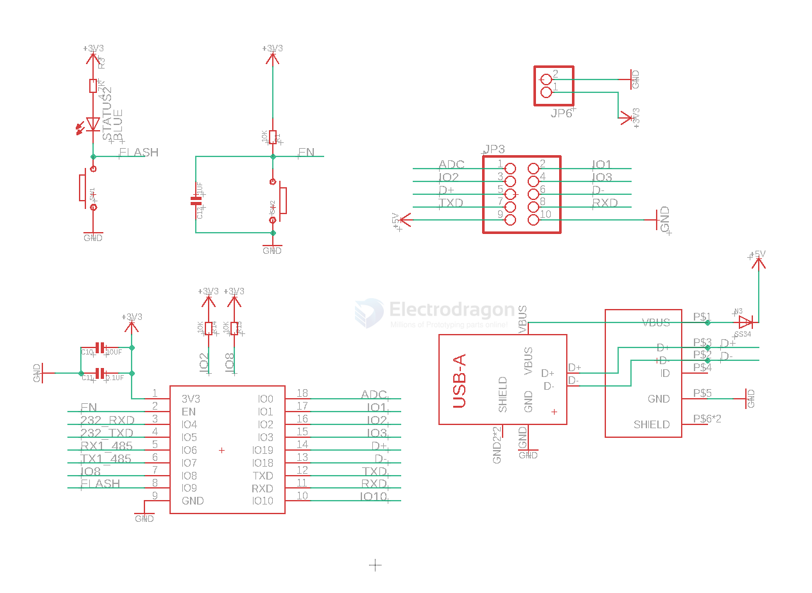
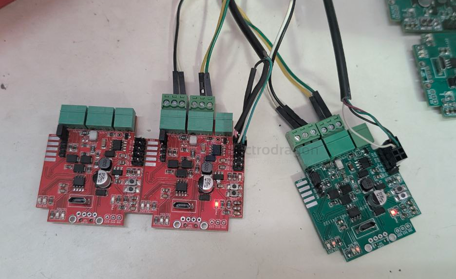

# NWI1254-dat

- this is a succsessor of [[NWI1252-dat]], further add [[RS232-dat]] interface

- [[RS485-dat]]

- [[ESP32-C3-dat]] - [[ESP32-C3-SDK-dat]]

## Info

product url - [[NWI1252-dat]]

### Board Map, Dimension, Pins, chip info, Use Guide, Setup Jumper, etc.

- set red and yellow jumpers for [[RS485-dat]]
- set blue jumpers for [[RS232-dat]]

red box 
- data communication LED indicator 
- spare pins 
  - IO6 IO7 IO8 
  - ADC IO2 D+ TXD 3V3
  - IO1 IO3 D- RXD GND
- EN button and flash button = IO10
- power LED
- flash button programmable LED = IO9

yello box
- Power input 

Green Box 
- USB A native USB
- micro USB native USB, same

Blue box 
- jumper, RS232 / RS485 output selector 
- GND / +5V 
- DB9 connector, includes a jumper selector for pin2 
- cable terminal output RS232 / RS485, 

- [[DB9-dat]] 

- [[dcdc-down-dat]] == 3A, Wide Input Range, Step-Down Converter 

Wide input voltage range:

– TPS5430: 5.5V to 36V

- [[resistor-feedback-dat]]

main controller part SCH 

## Applications, category, tags, etc. 

## Demo Code and Video

note the [[RS232-dat]] interface should be twisted, wire as TX-RX and RX-TX

## default flash data 

[[esptool-dat]] 

    "C:\Users\Administrator\AppData\Local\Arduino15\packages\esp32\tools\esptool_py\5.1.0/esptool.exe" --chip esp32c3 --port "COM15" --baud 921600  --before default-reset --after hard-reset write-flash  -z --flash-mode keep --flash-freq keep --flash-size keep 0x0 "C:\Users\Administrator\AppData\Local\arduino\sketches\45267CD3CF422CD163E590AF8B86E223/NWI1254-3.ino.bootloader.bin" 0x8000 "C:\Users\Administrator\AppData\Local\arduino\sketches\45267CD3CF422CD163E590AF8B86E223/NWI1254-3.ino.partitions.bin" 0xe000 "C:\Users\Administrator\AppData\Local\Arduino15\packages\esp32\hardware\esp32\3.3.1/tools/partitions/boot_app0.bin" 0x10000 "C:\Users\Administrator\AppData\Local\arduino\sketches\45267CD3CF422CD163E590AF8B86E223/NWI1254-3.ino.bin" 

## update logs and issues 

- [[CONN-USB-micro-vertical-dat]] - [[CONN-USB-dat]] - [[conn-usb-type-c-dat]]

- [[interactive-dat]]

## ref 

- [[NWI1254-fab]]

- [[NWI1254]] - [[NWI1252]]

- legacy wiki page 
