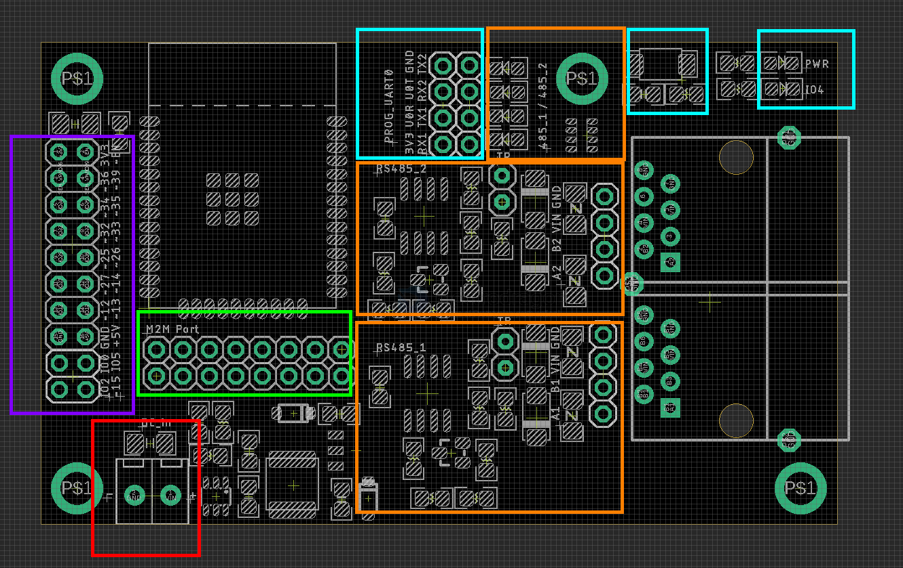
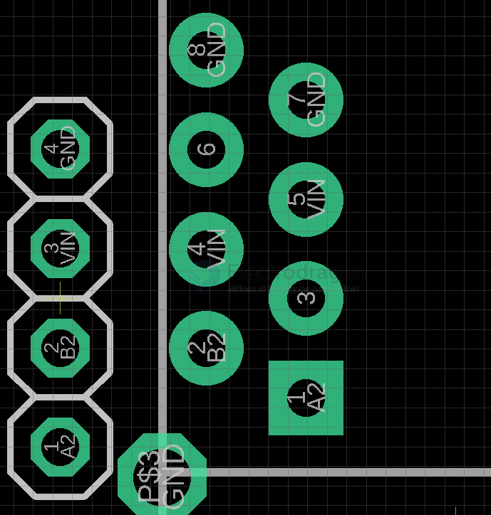

# NWI1264-dat

2x [[RS485-dat]] output to [[ethernet-dat]] port [[RJ45-dat]], and TX/RX indicator 

output pins: 

- pin1 A
- pin2 B
- pin 4 + 5 == VIN
- pin 7 + 8 == GND  

[[M2M-dat]] addon port 

[[DCDC-down-dat]] 

extra pin headers 

reset button / power indicator / IO4 programmer LED - [[LED-dat]]

## ref 

