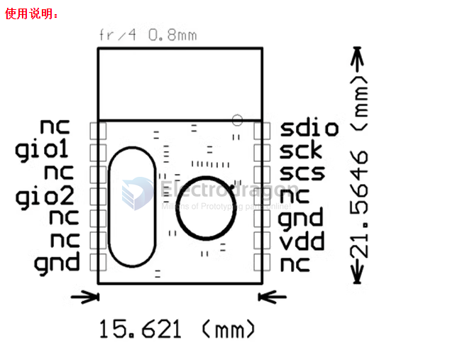

# NWL1058-dat 

- legacy wiki page - https://w.electrodragon.com/w/A7105

| Pinout       | Definition | Descriptions         |
| ------------ | ---------- | -------------------- |
| 1,3,5,6,8,11 | NC         |                      |
| 2            | GIO1       | 多功能管脚1          |
| 4            | GIO2       | 多功能管脚2          |
| 7,10         | GND        | 电源地               |
| 9            | VDD        | 输入电源（3.0—3.3V） |
| 12           | SCS        | SPI使能              |
| 13           | SCK        | SPI时钟              |
| 14           | SDIO       | SPI数据              |

https://www.electrodragon.com/product/2-4g-wireless-module-a7105/

## Note 

VCC pin voltage range is between 1.9V~3.6V. It should not be outside this range, exceeding 3.6V will burn the module. Recommended voltage is around 3.3V. Except for the power supply VCC and ground, the remaining pins can be directly connected to ordinary 5V microcontroller IO ports without level conversion. Of course, it is more suitable for microcontrollers around 3V.

Precautions:

When connecting to the P0 port of the 51 series microcontroller, a 10K pull-up resistor is required. It is not required when connecting to other ports. For other series of microcontrollers, if it is 5V, please refer to the output current of the microcontroller's IO port. If it exceeds 10mA, a series resistor is required for voltage division, otherwise the module may be burned! If it is 3.3V, it can be directly connected to the IO port line of the nRF24l01 module, such as the AVR series microcontroller.

The wireless module is an electrostatic sensitive device. Please pay attention to electrostatic protection during use, especially in dry winter. Try not to touch the devices on the module to avoid unnecessary damage.

## ref 

- [[A7105-dat]]

- [[NWL1058]]