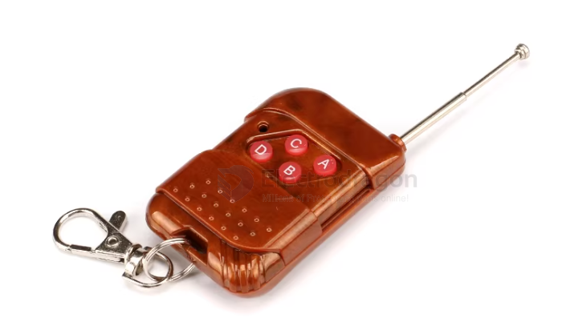
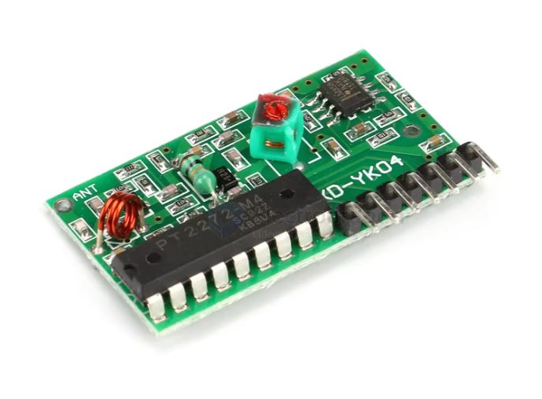
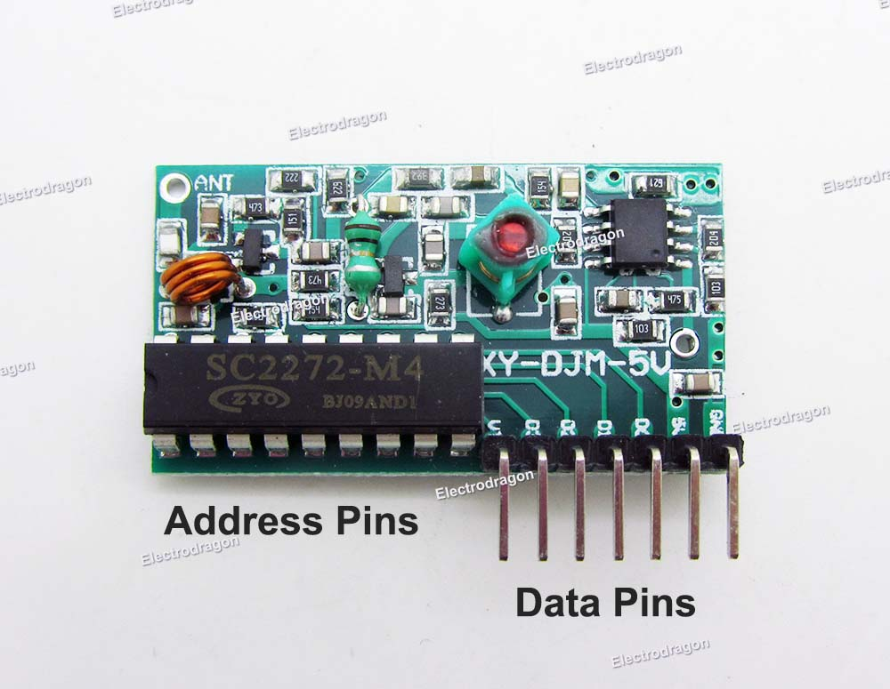
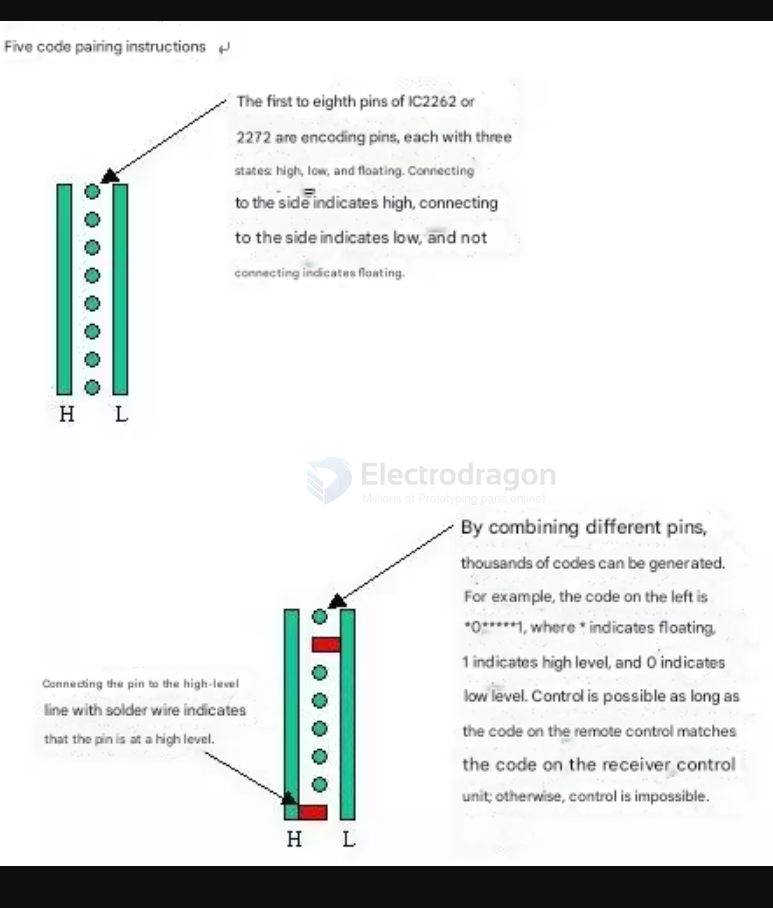
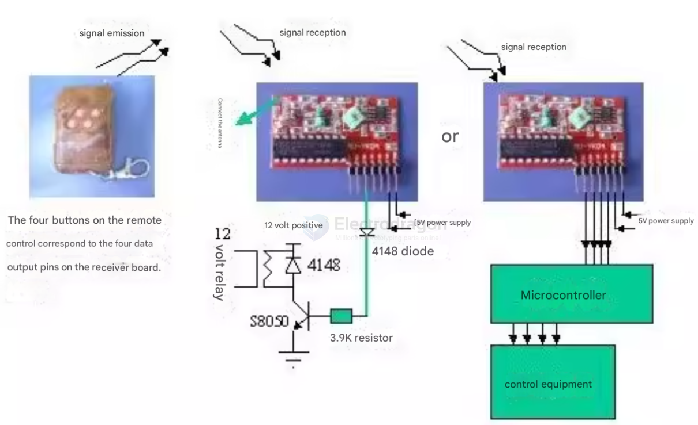

# NWL1060-dat

## Info

[product url - Wireless RF Link, PT2262 & PT2272 Encoder Decoder](https://www.electrodragon.com/product/2262-2272-wireless-module/)

please note one side of the chip is not soldered! 

### Board Map, Dimension, Pins, chip info, Use Guide, Setup Jumper, etc.

**Working frequency (MHz)：315MHz**

- Working voltage (V): DC 5 V  
- Static current (mA): 4.5 mA  
- Modulation: AM (OOK)  
- Operating temperature: –10 ℃ to +70 ℃  
- Receiving sensitivity (dBm): –105 dBm  
- Working frequency (MHz): 315 MHz  
- Encoding method: Pad soldering (fixed code)  
- Operating mode: M4 (momentary: output is active only while the button is held; it stops when released)  
- Dimensions (L×W×H): 41 × 23 × 7 mm  

### Product features

The super‑regenerative receiver module uses an LC oscillation circuit and includes amplification and shaping. The output data signal is a decoded high‑level signal, which is very easy to use and low cost, so it is widely used. 

It provides four decoded outputs by default (which can also be changed to six momentary or inter‑lock outputs), making it convenient to use. The frequency point is easy to adjust, lead time is short, product consistency is good, and the cost performance is high.

The receiver module has a relatively wide receive bandwidth, typically ±10 MHz. It is usually factory‑tuned to 315 MHz or 433.92 MHz (the frequency can be adjusted on request within 266–433 MHz). The module is typically powered by DC 5 V (other voltage ranges can be customized if needed).

The first to eighth pins of the transmitter IC2260 and receiver IC2272 are address encoding pins. Each pin has three states: high, low, and floating. Connecting to the “H” side represents 1, connecting to the “L” side represents 0, and leaving it unconnected represents “*”. Communication is possible only when the encoding on the remote control module matches the encoding on the receiver module; otherwise, communication is not possible.

The VCC voltage must match the module’s operating voltage, and the power supply should be properly filtered.

The antenna has a large impact on the reception performance of the module. It is best to use a 1/4‑wavelength antenna, typically a 50‑ohm single‑core wire. The antenna length is about 23 cm for 315 MHz and about 17 cm for 433 MHz.

The antenna position also affects the reception performance. When installing, keep the antenna as straight as possible and away from shielding objects, high‑voltage lines, and interference sources.

The receive frequency and decoding method must match the transmitter during use.

Operating modes:  
- **M4 (momentary)**: output is active only while the button is held; it stops when released.  
- **L4 (inter‑lock)**: only one of the four channels can be active at a time.  
- **T4 (self‑lock / toggle)**: the four channels are independent; pressing once turns the output on, pressing again turns it off.

Note: The default mode is momentary (M4). Other modes can be provided for

### solder pin and coding 

Pins 1 through 8 of the IC2262 or 2272 are encoding pins. Each pin has three states: high, low, and floating. Connecting to the 'H' side indicates high, the 'L' side indicates low, and leaving it unconnected indicates floating.

Through different combinations, thousands of codes can be generated from these 8 pins. For example, the code on the left is *0*****1, where * indicates floating, 1 indicates high level, and 0 indicates low level. Control is possible as long as the code on the remote control matches the code on the receiver control section; otherwise, control is impossible.

Connecting a pin to a high-level line with solder wire indicates that the pin is at a high level.

### pins 

| Pin | Name | Description              |
|-----|------|--------------------------|
| 1   | VT   | Status output indicator  |
| 2   | D3   | Data output              |
| 3   | D2   | Data output              |
| 4   | D1   | Data output              |
| 5   | D0   | Data output              |
| 6   | 5V   | Power supply positive    |
| 7   | GND  | Power supply ground      |
| —   | ANT  | Antenna                  |

The receiver module has eight external interfaces, each labeled in English.  
“5V” is the positive power supply, “D0, D1, D2, D3” are data outputs, “GND” is the power supply ground, and “ANT” is the antenna connection.

### Application environment (application fields)

Wireless remote control switches, remote control sockets, data transmission, remote control toys, burglar alarm hosts, garage doors, rolling doors, barrier gates, retractable doors, and other door‑control applications, as well as remote‑controlled audio and similar fields.

### Optional accessories

Used together with the company’s transmitter series and remote controller series products.

## Applications, category, tags, etc. 

- [[PT2262-dat]] - [[PT2272-dat]] - [[RF-link-dat]] - [[network-dat]]

## wiring 

## Demo Code and Video

## ref 

- Simple Tutorial – http://electrodragon.com/?p=1103

- [[NWL1060]] 

- [legacy wiki page ](https://w.electrodragon.com/w/Category:RF-Link)

