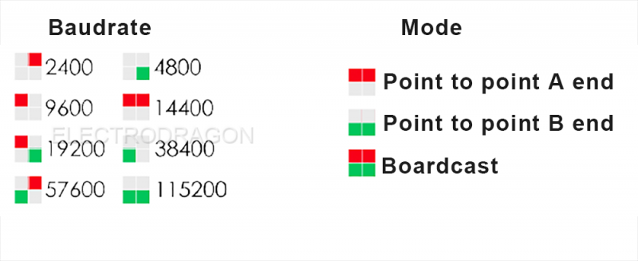

# NWL1065-dat

## Config Steps

* two red led on top, two green leds on bottom
* Long press and release to enter into next config
* Modules can communicate when the channel is same, even baudrate is different

| Step                    | Action (short press)     | Indication                                                                           |
| ----------------------- | ------------------------ | ------------------------------------------------------------------------------------ |
| 1. Enter into Config    | HOLD button and power up | all leds blink in turn                                                               |
| 2. config baudrate      | switch baudrate          | see image on the right                                                               |
| 3. Set wireless channel | choose channel           | LED indicate 16 channels, including all leds off status                              |
| 4. Mode set             | switch in three modes    | see image on the right                                                               |
| 5. Confirm              | -                        | long press until led blink in turns, and release LED will remain for 2 secs and done |

## Config setup 

## ref 

- legacy wiki page - https://w.electrodragon.com/w/2.4G_Zigbee_CC2530_Module

- [[TI-network-dat]]

- [[NWL1065]]