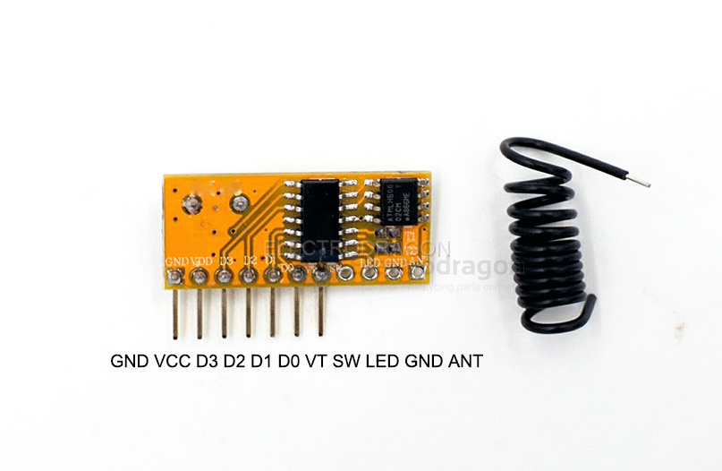

# NWL1070-dat

[EDRF2 RF Switch Receiver 433/315mhz w/Decoder](https://www.electrodragon.com/product/rf-switch-receiver-433315mhz-wdecoder/)

## Features 

- sensitivity == -110dBm； 

- on board chip [[SYN470-dat]]

## supported chips 

On board Decoder, support and match with other encoder chip like

- [[PT2262-dat]] (fixed code), find the PT2262/2272 kit here.(it is 315mhz)
- [[EV1527-dat]] (learning code), you can find the nice look and safety receiver here.
- Wireless switch relay use EV1527 here.

## ref 

- [[RF-link-dat]]