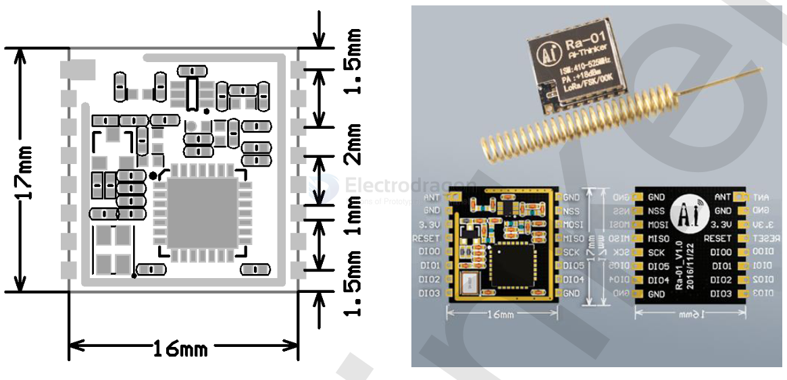
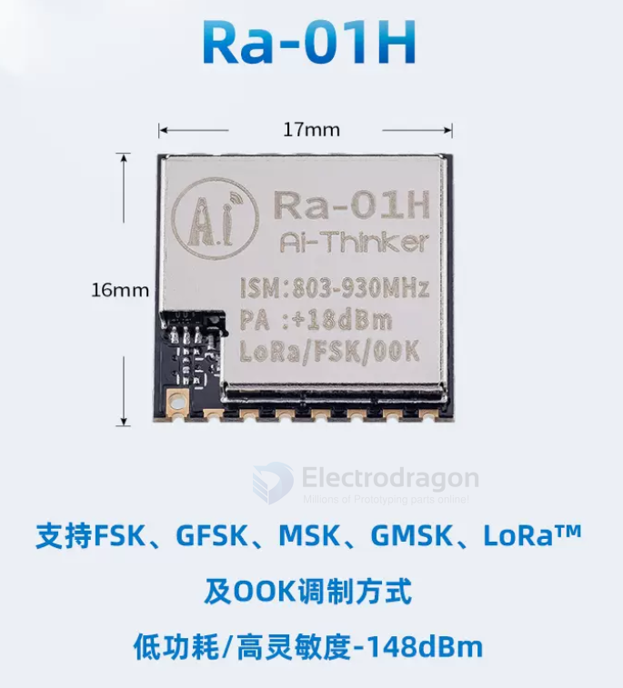

# NWL1071 dat 

[Lora RF Wireless Transceiver EE1, 100mW [Freq]](https://www.electrodragon.com/product/sx1278-lora-wireless-transceiver-433mhz100mw)

dimension == 17 x 16 x 3.2

| SX1278-L | SX1278-R |
| -------- | -------- |
| ANT      | GND      |
| GND      | NSS      |
| 3.3V     | MOSI     |
| RESET    | MISO     |
| D0       | SCK      |
| D1       | D5       |
| D2       | D4       |
| D3       | GND      |

## Apps 

- [[MPC1056-dat]]

## ref 

- DS RA-01H - [[ra-01h_product_specification_en.pdf]]

- DS RA-01 - [[ra-01_product_specification_v1.1.pdf]]

- [[Lora-dat]] - [[lorawan-dat]]

- [[NWL1071]]