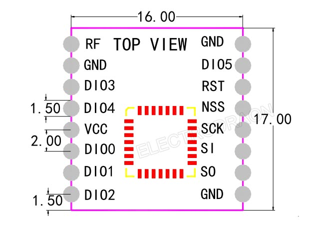

# NWL1074 dat 

- [[lora-chip-dat]] - [[lora-modules-dat]] - [[lora-dat]] 

- [[MPC1056-dat]]

lora modules - https://www.electrodragon.com/product/sx1278-lora-wireless-transceiver-433mhz100mw/

## Info 

* Compatible with RFM95, RFW95W, RFM96W, RFM98, etc. Lead out two extra DIO3 and DIO4

size 16 x 17 

## ref 

- [[lora-dat]]

- [legacy wiki page](https://www.electrodragon.com/w/Category:HPD_Lora_MOD)

