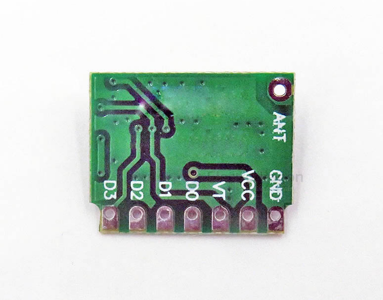

# NWL1089-dat

[EDRF1 Wireless Remote Receiver Decoding Module 433Mhz](https://www.electrodragon.com/product/edrf01-wireless-remote-receiver-decoding-module-433mhz/)

https://w.electrodragon.com/w/EDRF1

Compatible with most learning codes and fixed (welded code) code chips in the market, including EV1527, PT2262, HX2262, SC2260, SC5211, HS2240, etc.

## ref 

- [[RF-link-dat]]

- [[RF-dat]]

- [[NWL1089]]