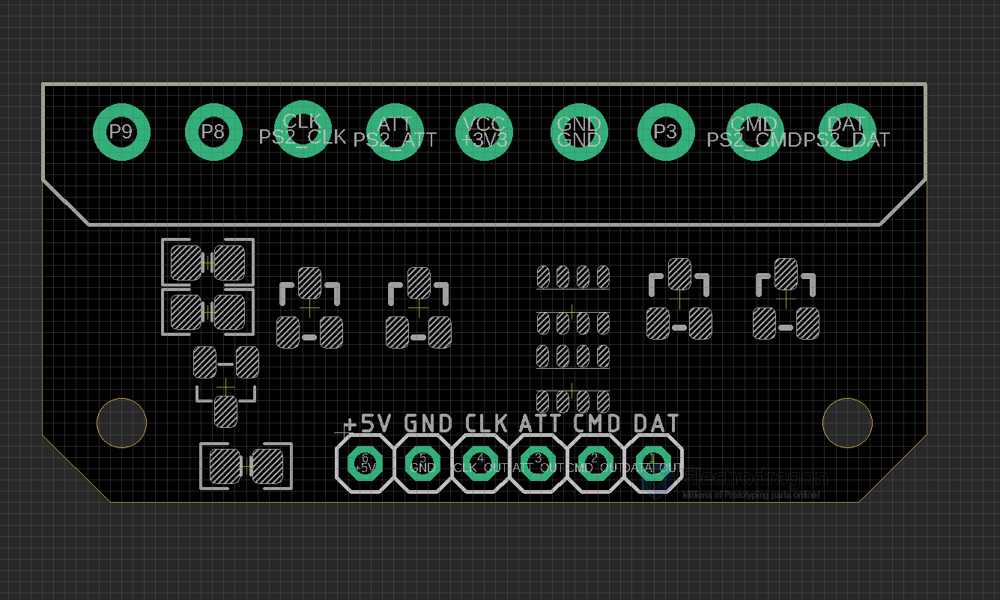

# NWL1093-dat

## Board map and Features 

- on-board logic level shifters for four signal lines
- on-board LDO 

Pin Definitions - from left to right 

- NC (P9)
- NC (P8) 
- PS2_CLK
- PS2_ATT
- VCC_3V3
- GND
- NC (P3)
- PS2_CMD
- PS2_DAT

## ref 

- [[arduino-lib-dat]]