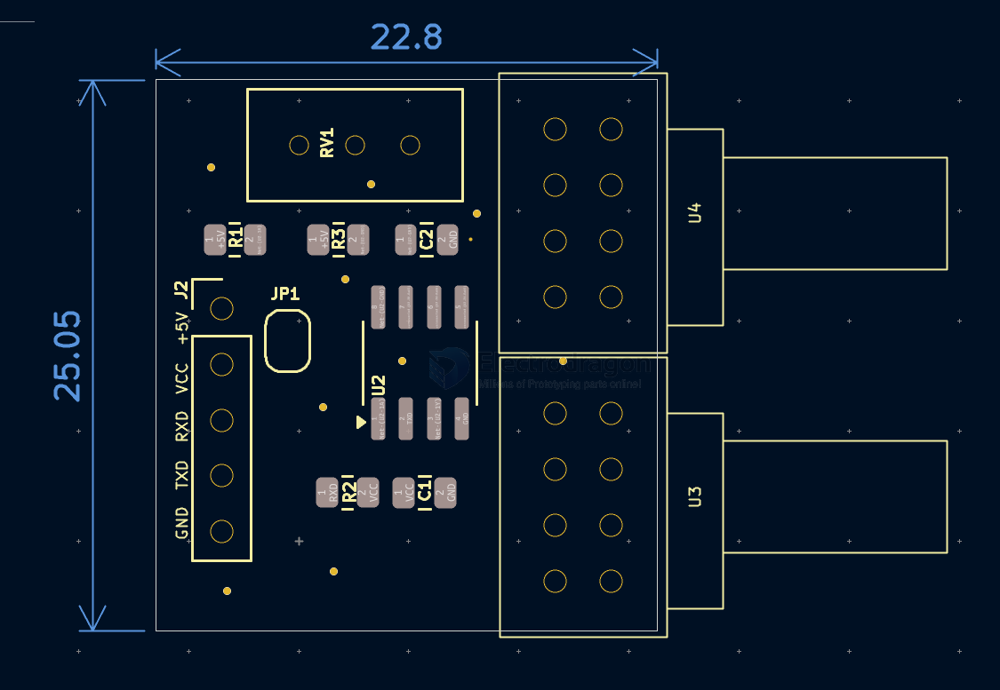

# NWL1116-dat

## Info

[product url - POF Plastic Fiber Cable TTL Serial Transceiver Board](https://www.electrodragon.com/product/pof-plastic-fiber-cable-ttl-serial-transceiver-board/)

### Board Map, Dimension, Pins, chip info, Use Guide, Setup Jumper, etc.

Pin Definitions 5V / VCC / TXD / RXD / GND 

note the wiring 

- target TX - to on board TX
- target RX - to on board RX

board map 

- [[SN75451-dat]] - [[transistor-array-dat]]

- [[HFBR-dat]] - [[HFBR-x4xx-dat]] - [[NWL1116-dat]]

## Applications, category, tags, etc. 

- [[fiber-optic-board]] - [[POF-dat]]

## Demo Code and Video

## ref 

- [[NWL1116]] 

- legacy wiki page 
