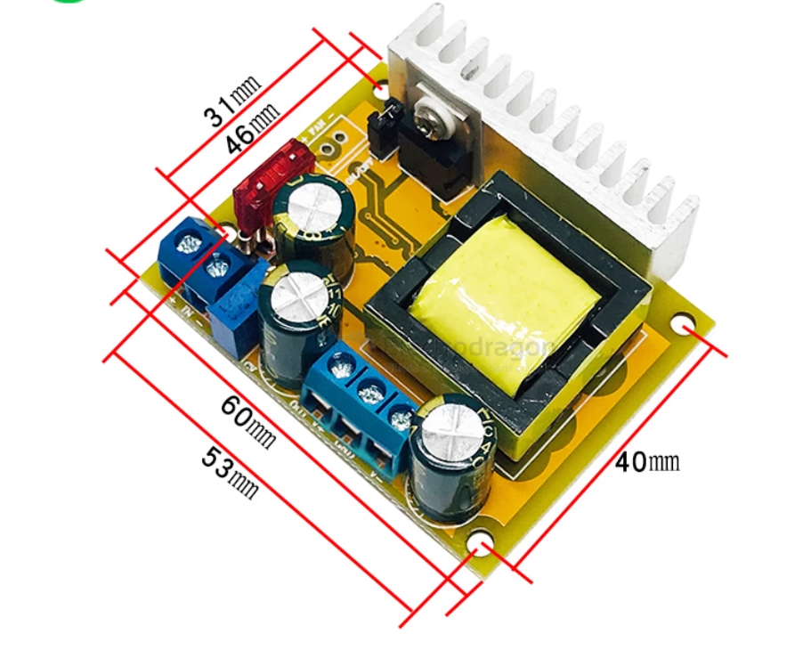

# HV-module-dat

- [[high-voltage-dat]]

- High Voltage Boost Module 

- [product link - DCDC Booster Step-Up High Voltage Generator Module ADJ. 45~390V](https://www.electrodragon.com/product/dcdc-booster-step-up-high-voltage-generator-module-adj-45390v/)

## potention quality issue 

- please double check the large capacitor, if the withstand voltage is not enough, it may explode

- on board capacitor withstand voltage is 400V, will be slightly risky if set output to 390V, please use with caution

- consider its price, be merciful

## Module Function 

dimension 

## usage 

- CW tune to increase output voltage, CCW tune to decrease output voltage

## Module Info 

- Non-isolated Boost Converter

### Input Specifications
- **Input Voltage:** Two selectable ranges (set via PCB rear jumper, default is 10-32V)
  1. 8–16V (for 3S lithium batteries and 12V lead-acid batteries)
  2. 10–32V (for wide input voltage applications)
- **Input Current:** Max 5A
- **Quiescent Current:** 15mA (at 12V to 50V boost; increases with higher output voltage)

### Output Specifications
- **Output Voltage:** 
  1. 45–390V continuously adjustable
  2. ±45–390V continuously adjustable (default ±50V; for other voltages, please specify when ordering)
  - Module has voltage regulation; output voltage remains stable and does not change with input voltage.
- **Output Current:** Max 0.2A (depends on input/output voltage difference; higher output voltage means lower output current)
- **Output Power:** 40W (peak 70W)

### Protection Features
- **Short Circuit Protection:** Yes (10A input fuse; do not directly short output or draw arcs, as this may damage rectifier components. Use a power resistor in series for arc drawing.)
- **Overcurrent Protection:** Yes (reduces output voltage if input current exceeds 4.5A)
- **Overvoltage Protection:** Yes (reduces output voltage if output exceeds 410V)
- **Reverse Polarity Protection:** Yes (non-self-resetting; reverse connection will blow the fuse, avoid reverse connection)

### Other Specifications
- **Operating Temperature:** -40°C to +85°C (enhance cooling if ambient temperature is high)
- **Operating Frequency:** 75kHz
- **Conversion Efficiency:** Up to 88% (depends on input/output voltage, current, and voltage difference)
- **Mounting:** 4 × 3mm screws
- **Wiring:** Terminal block for solderless output (soldered output if with enclosure)
- **Module Dimensions:** 60mm (L) × 50mm (W) × 22mm (H)

### Capacitor Charging Time (Measured Data)
- 470μF to 390V: 2 seconds
- 1000μF to 390V: 4 seconds
- 2200μF to 390V: 8 seconds
- 4700μF to 390V: 18 seconds

### Important Safety Note
> **Warning:** This module outputs high voltage, which is dangerous to humans and animals. Please take proper safety precautions during use. The seller is not responsible for any consequences resulting from improper use or handling of the module.

## ref 

- [[tech-dat]]