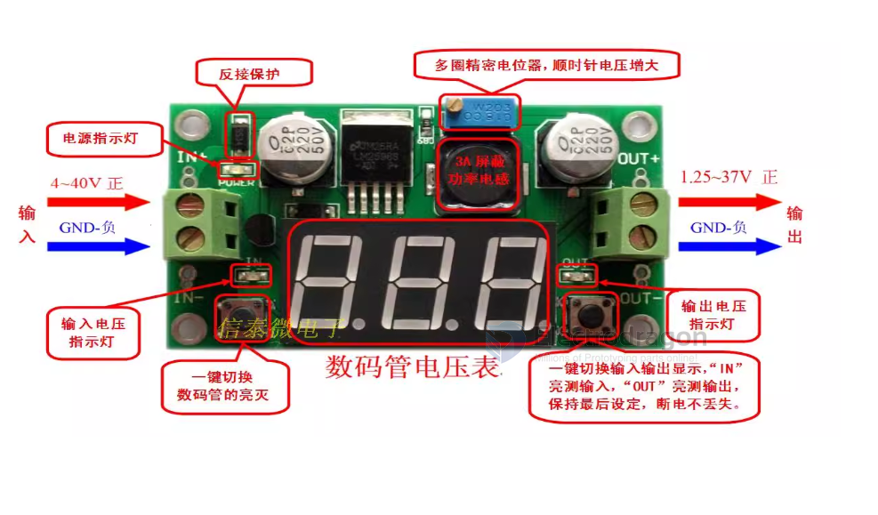
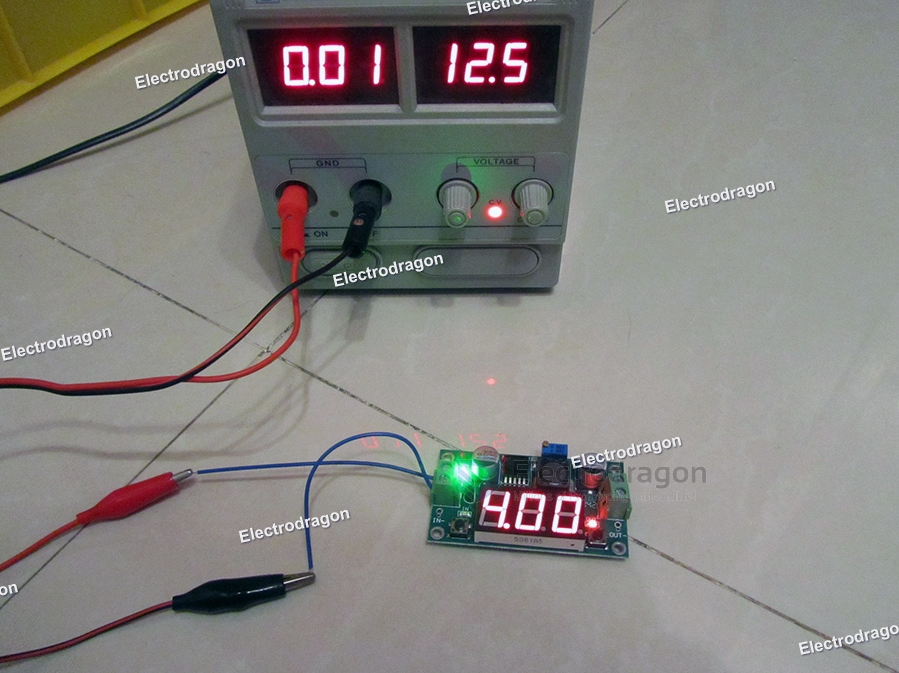

# OPM1003-dat

### Params 

- Input voltage 2.5V~40V 
- The output voltage 1.25V~37V (adjustable) 
- Output current 3A (maximum) 
- Conversion efficiency 92% (highest) 
- Output ripple <30mV 
- On-off level 150KHz 
- Operating temperature -45℃~ +85℃

### Application scope:

This module can be used in voltage reduction fields where the input voltage is higher than the output voltage, such as batteries, power transformers, DIY adjustable regulated power supplies, 24V vehicle laptop power supplies, industrial equipment voltage reduction, 12V to 3.3V, 12V to 5V, 24V to 5V, 24V to 12V, 36V to 24V, etc.

### Features:

1. With voltmeter display, the voltmeter error is ±0.1V, and the range is 4~40V. (Note: If the input voltage is lower than 4V, the onboard voltmeter will not work or display)

2. The large 5*5 touch button switches the measurement input or output voltage, and an indicator light shows which voltage is being measured. By default, when the device is turned on for the first time, the digital tube displays the input voltage, and the input indicator light IN is on; touch the button, and the digital tube displays the output voltage, and the output indicator light OUT is on. And keep the last settings, even if the power is turned off and on again

3. The voltmeter can be turned off by pressing and holding the switch for more than 1 second and less than 4 seconds, and then letting go. After the voltmeter is turned off, just press the switch briefly to turn on the voltmeter.

4. Input and output voltage measurement error calibration function. Press and hold the switch for more than 4 seconds. After letting go, it will enter the voltage measurement error calibration function. At this time, the IN light is on (calibration input terminal), and the digital tube flashes to display the correction value (factory parameter is 0.0). , at this time, short press the button to change this value (the value range is -0.5~0.5, the unit is V), the positive number means upward calibration, and the negative number means downward calibration. After adjusting the calibration value of the input terminal, press and hold the button for more than 2 seconds. After letting go, enter the error calibration of the output terminal. At this time, the OUT light turns on (calibrating the output terminal) and displays the calibration value of the output terminal. The adjustment method is the same as that of the input terminal. The adjustment method is the same as that of the input terminal. After calibrating the output end value, press and hold the button for more than 2 seconds. After letting go, the set value will be saved and the normal display voltage will return. The set correction value will take effect immediately and will not be lost after power failure. (With this function, you can meet your higher accuracy requirements)

5. With terminal blocks, it can be used easily without a soldering iron, and the soldering wire connection points are retained.

(The input voltage must be more than 1v higher than the output voltage)

6. Using an internal oscillation frequency of 150KHz, it is a second-generation switching voltage regulator with low power consumption and high efficiency.

7. The input end is protected by a diode, and reverse connection will not burn out the module.

8. With overheating protection and short circuit protection (please strengthen heat dissipation if it exceeds 15W)

### Precautions:

- The maximum output current can be as high as 3A. It is recommended that the operating current be around 2A. If it exceeds 2A, a heat sink should be added.
- When encountering the problem that the output voltage cannot be adjusted and is always equal to the input voltage, please rotate the potentiometer counterclockwise for more than 10 turns, and then use the module to adjust the voltage normally. Because when the buck module leaves the factory, the default output voltage is around 20V.

### Dimension 

### Functions 

### Testing 

## ref 

- [[LM2596-dat]]