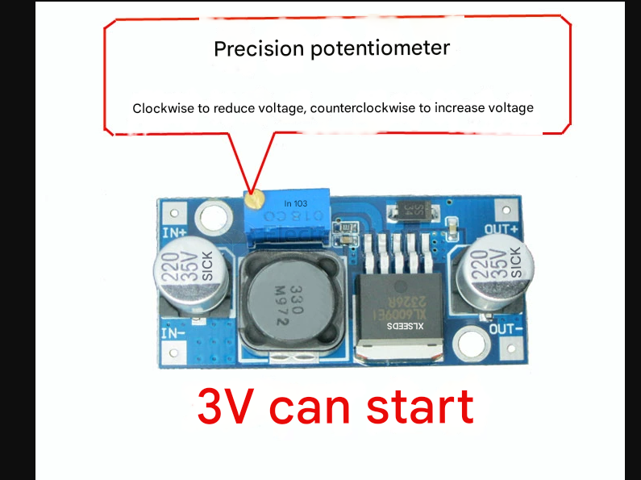
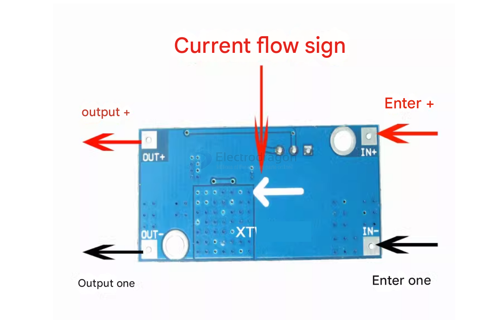

EDXL6009# OPM1009-dat

## Info

[product url - XL6009 DC Step-up ADJ Power Module 4A](https://www.electrodragon.com/product/xl6009-step-dc-boost-adj-module-4a/)

### Board Map, Dimension, Pins, etc.

#### XL6009 400KHz 4A Switching Current Boost Module

The EDXL6009 is a high-performance boost (BOOST) module with a 4A switching current. This module uses the XL6009E1, a 3rd generation high-frequency switching technology chip, as its core, and its performance far exceeds the 1st generation technology LM2577. The XL6009 boost module has lower cost and more excellent performance, and the LM2577 module is about to be eliminated.

*   ● Ultra-wide input voltage 4.5V~32V, the best working voltage range is 5~32V;
*   ● Ultra-wide output voltage 5V~40V;
*   ● Built-in 4A high-efficiency MOSFET switch tube, which makes the efficiency up to 94%; (LM2577 current is only 3A)
*   ● Ultra-high switching frequency of 400KHz, can achieve very good results with small-capacity filter capacitors, with smaller ripple and smaller size. (LM2577 frequency is only 50KHz)

##### Technical Parameters:

*   Model Specifications | EDXL6009 Boost Module
*   Module Properties | Non-isolated boost (BOOST)
*   Rectification Method | Non-synchronous rectification
*   Input Range | 4.5V~32V
*   Output Range | 5V~40V
*   Input Current | Peak 4A (It is recommended to work at 1.5A or less for a long time), no-load 18mA (5V input, 8V output, no-load less than 18mA. The higher the voltage, the greater the no-load current.)
*   Conversion Efficiency | <94% (The greater the differential pressure, the lower the efficiency)
*   Switching Frequency | 400KHz
*   Output Ripple | 50mV (The higher the voltage, the greater the current, the greater the ripple)
*   Load Regulation | ±0.5%
*   Voltage Regulation | ±0.5%
*   Operating Temperature | -40℃~ +85℃
*   Dimensions | 43mm \* 21mm \* 14mm (L\*W\*H)
*   

### Wiring:

-   IN+ Input positive, IN- Input negative!
-   OUT+ Output positive, OUT- Output negative

### Test Results

Reference test comparison examples:

| Input (V) | Output (V) | Output (A) | Output (W) |
| --------- | ---------- | ---------- | ---------- |
| 5         | 12         | 0.8        | 9.6        |
| 7.4       | 12         | 1.5        | 18         |
| 12        | 15         | 2          | 30         |
| 12        | 16         | 2          | 32         |
| 12        | 18         | 1.6        | 28.8       |
| 12        | 19         | 1.5        | 28.5       |
| 12        | 24         | 1          | 24         |
| 3         | 12         | 0.4        | 4.8        |

Vin \* Iin \* Efficiency = Vout \* Iout

-   Vin: Input Voltage
-   Iin: Input Current
-   Vout: Output Voltage
-   Iout: Output Current

For example: Input 5V, 1A, Output 10V, 0.45A, Efficiency 90%

`5 * 1 * 90% = 10 * 0.45A`

## Applications, category, tags, etc. 

- [[XL6009-dat]]

## Demo Code and Video

## ref 

- [[OPM1009]] 

- legacy wiki page 

- bulk order discount 22% for 200pcs+ 

