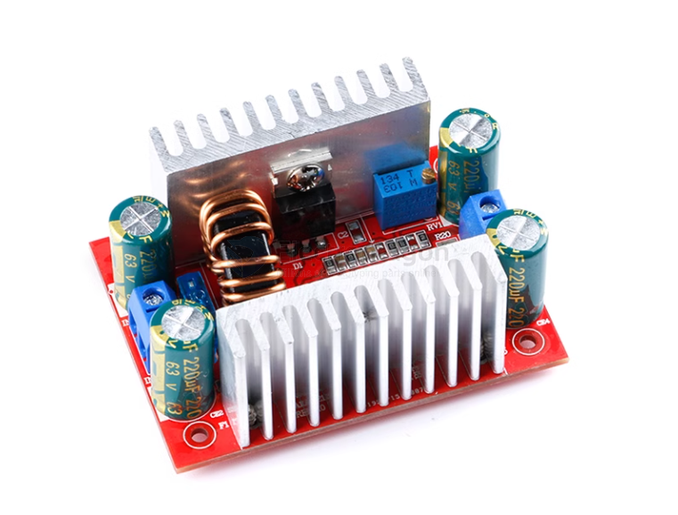

# OPM1013-dat

https://www.electrodragon.com/product/150w-adj-dc-boost-module/

- Conversion efficiency: 94% (measured at 16V input and 19V output 2.5A) (for reference only)
- Output ripple: 2% (MAX) 20M bandwidth
- Operating temperature: industrial grade (-40℃ to +80℃) (if the ambient temperature exceeds 40 degrees, please reduce the power or add a fan)
- Full load temperature rise: 45℃
- Weight: 63g/piece
- No-load current: typical 25mA
- Load adjustment rate: ±0.5%
- Voltage adjustment rate: ±0.5%
- Dynamic response speed: 5% 200uS
- Short circuit protection: None (please install a fuse or protection circuit at the input)
- Input reverse protection: None, buyers can connect a diode in series at the input.
- Wiring method: No welding, terminal

## usage 

Output voltage/current adjustment method:

1. Adjust the "CV-ADJ" potentiometer to set the output voltage to the voltage value you need according to your battery or LED. For example, adjust the voltage of 10 strings of LEDs to 37V. (Adjust the voltage counterclockwise to increase, and adjust the voltage clockwise to decrease)

2. Adjust the "CC-ADJ" potentiometer counterclockwise for about 30 turns to set the output current to the minimum, connect the LED, and adjust the RV2 potentiometer to the current you need. For battery charging, discharge the battery, connect it to the output, and adjust RV2 to the current you need. (When used for charging, you must use a discharged battery to adjust it accurately because the more power the battery has, the smaller the charging current.) ((Adjust the counterclockwise current to decrease, and adjust the clockwise current to increase)

**Please do not use a short-circuit to adjust the current. The circuit structure of the boost module cannot be adjusted by a short-circuit.**

## ref 

- [[LM2577-dat]]

- [[OPM1013]]