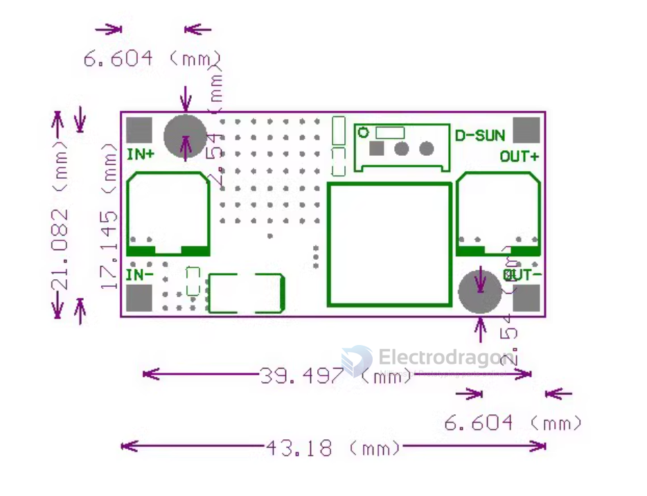
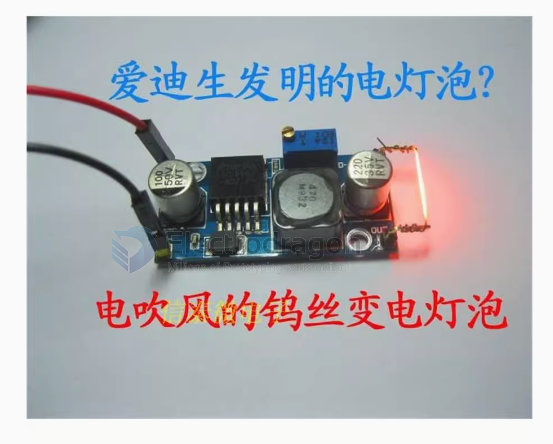

# OPM1026-dat

- legacy wiki page - https://w.electrodragon.com/w/Category:DC-DC_Buck

## Features: 

- Model Name LM2596S DC-DC step-down module 
- Input voltage 3.2V~46V (recommended to be used within 40V) 
- The output voltage 1.25V~35V Output current 3A (not more than) 
- Conversion efficiency 92% (not more than) 
- Output ripple <30mV 
- On-off level 65KHz 
- Operating temperature -45℃~ +85℃ 
- Size 43mm * 21mm * 14mm (length * width * height)

## output voltage tuning 

factory tuning output volatge around 20V
each counter clock tuning = 1V

## Pin Definitions 
- IN+ input positive pole
- IN-input negative pole!
- OUT+ output positive pole
- OUT-output negative pole

## output and input 

Input voltage range: DC 3.2V to 46V

It is recommended to use within 40V! (The input voltage must be more than 1.5V higher than the output voltage. It cannot be boosted)

Output voltage range: DC 1.25V to 35V, continuously adjustable voltage, high efficiency (maximum 92%)

The maximum output current is 3A.

The actual measured load regulation rate at 12V input and 5V output current is less than 1% when the current is 1A.

## Note: 

- This is a buck module, the input voltage must be higher than the output voltage.
- If the output is below 2A, you don’t need to add a heat sink for a long time. 
- If the output current is greater than 2.5A (or the output power is greater than 10W), please add a heat sink when working for a long time.

## Dimension 

## Applications Examples 

- output running Tungsten

## ref 

- [[LM2596-dat]]

