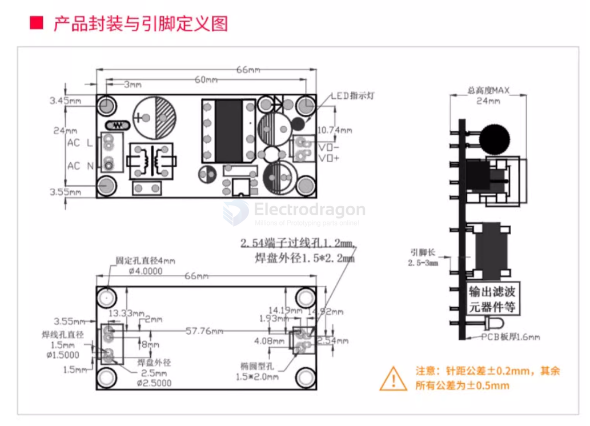
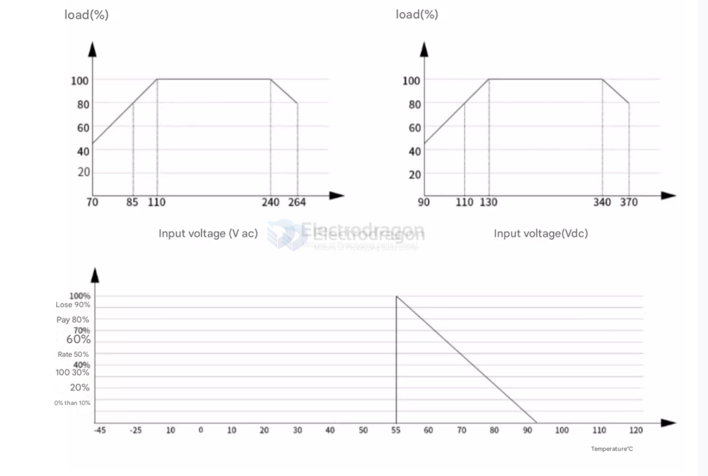

# OPM1070-dat 

## Specs 

- Working temperature (°C) Normal conditions meet the following figure derating -25°~+70°
- Working humidity (RH) 20-90%, no condensation
- Temperature drift coefficient ±0.02%/°C
- Storage temperature and humidity -40~+85°C 10-95%RH
- Switching frequency (KHz) 65
- Insulation voltage (VAC) input to output, test 605, ≤5mA3000VAC
- Insulation resistance (MQ) input to output, 500VDC 100
- Leakage current (mA) 500VDC input to output ≤0.25m A/RMS value
- MTBF@25°C (MIL-HDBK-217F)>215000h
- Safety level adaptation: CLASS B
- Vibration resistance 110-500Hz2G10 minutes/cycle.X, Y, Z 60 minutes each

- Electromagnetic compatibility 
  - ! Comply with: IEC62368-1/IEC61558-1ClassB
  - Lightning strike: differential mode 2KV, IEC61000-4-2ClassB, common mode: 2KV, IEC61000-4-2ClaSsB.

Note 

1. Unless otherwise specified, all specifications are measured at an input of 230vaC, rated load, and an ambient temperature of 25°C;
2. Ripple and noise measurement method: use a 12" twisted pair cable, and connect a 0.1uF capacitor in parallel to the terminal, and measure at a bandwidth of 20MHz;
3. Accuracy: includes the shear error, linear regulation rate, and load regulation rate;
4. The power supply should be regarded as part of the components in the system, and electromagnetic compatibility related confirmation should be carried out in conjunction with the terminal equipment;
5. The output needs to be reduced under low input voltage. Please refer to the reduction curve for details;

### Dimension 

### Module Electric Features 

## ref 

- [[ACDC-dat]]

- [[OPM1070]]