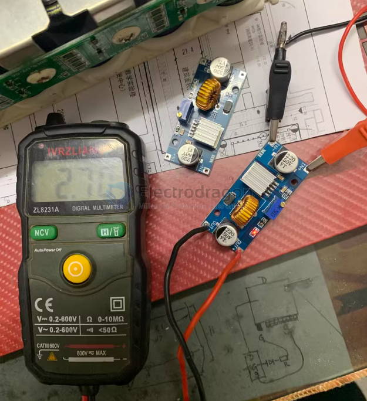

# OPM1085-dat

[CC&CV Buck Step-Down Power Module, XL4015, 5A](https://www.electrodragon.com/product/5a-cccv-buck-step-down-module/)

- [[XL4015-dat]]

- better use within 75W, add heatsink if use over 50W

- legacy wiki page - https://w.electrodragon.com/w/index.php?title=CV%26CC&CV_Buck_Step-Down_Power_Module=

## charge capacitor 

- 5V to 2.7V

## ref 

- [[OPM1085]] - [[XL-dat]]