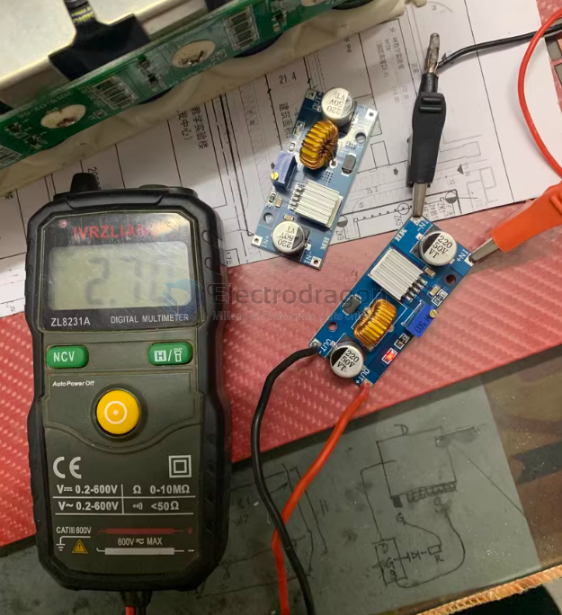

# OPM1085-dat

[CC&CV Buck Step-Down Power Module, XL4015, 5A](https://www.electrodragon.com/product/5a-cccv-buck-step-down-module/)

- [[XL-dat]] - [[XL4015-dat]] - [[dcdc-down-dat]] - [[OPM1171-dat]] - [[OPM1085-dat]] - [[CV&CC-dat]] 

- better use within 75W, add heatsink if use over 50W

- legacy wiki page - https://w.electrodragon.com/w/index.php?title=CV%26CC&CV_Buck_Step-Down_Power_Module=

模块亮点：

1.大功率，高效率，5A，低纹波；
2.三合一：

    -（1）作为具有过流保护能力的普通降压模块使用；
    -（2）作为各种电压值锂电池、电瓶、镍镉镍氢电池（电池组）充电器使用，用于太阳能电池板、风力发电机等场合；
    -（3）作为大功率LED恒流驱动模块使用；

3.具有恒压和恒流两种模式，有指示灯指示模块当前处于哪种模式；
4.作为锂电池充电器使用时，可以设置浮充电压和充电电流大小，有指示灯指示是正在充电还是已经充满；
5.具有限流保护功能，即使输出短路也不会烧坏模块。

## charge capacitor 

- 5V to 2.7V

## ref 

- [[OPM1085]] - [[XL-dat]]

- [[items]]