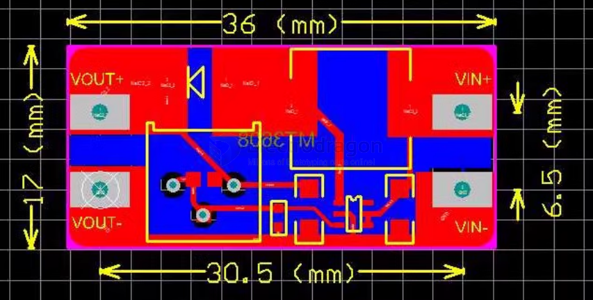

# OPM1089-dat

https://www.electrodragon.com/product/mt3608-2a-dc-dc-boost-step-adj-power-module/

- [[MT3608-dat]]

## Features 

1. Module characteristics (boost module):

- 1) Maximum output current: 2A
- 2) Input voltage: 2V ~ 24V
- 3) Maximum output voltage: > 5V-28V
- 4) Efficiency: > 93%

2. Mechanical properties:

Product size: 36mm * 17mm * 14mm

1. Usage method

After the module, + and - 2 ~ 24V, the output voltage can be adjusted by adjusting the potentiometer, the output voltage is greater than the input voltage

4. Precautions

- 1). The input voltage should not exceed the maximum input voltage
- 2). The peak current output current does not exceed 2A

## Dimension 

## FAQ 

Some customers reported that the module output voltage cannot be adjusted and is always equal to the input voltage. 

If you encounter this problem, please rotate the potentiometer counterclockwise for more than 10 turns, and then use the module to adjust the voltage normally.

## demo video 

- https://www.youtube.com/watch?v=cj9krSIrUUM

## ref 

- [[DCDC-boost-dat]]
