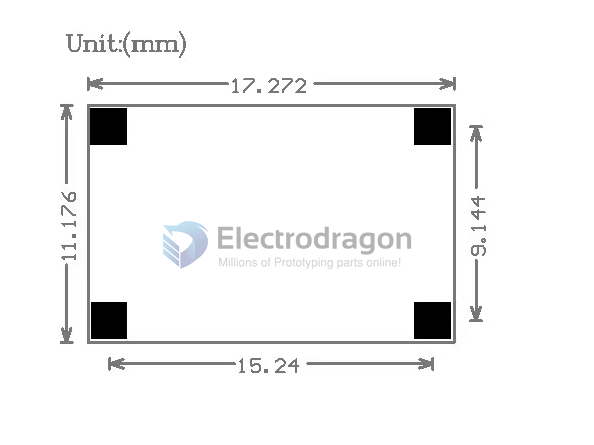

# OPM1091-dat

https://www.electrodragon.com/product/super-mini360-dc-dcsynchronous-rectified-buck-step-module/

## Specs 

Application fields: DIY mobile power supply, vehicle power supply, communication equipment power supply, various occasions with strict requirements on volume and weight (such as aviation models, etc.).

Technical Parameters:

- Model name Mini360 (ultra-small size DC-DC synchronous rectifier buck module)
- Module properties Non-isolated step-down
- Rectification method synchronous rectification
- Input voltage 4.75V-23V
- Output voltage 1.0V-17V
- Output current: peak value 3A, long time 1.8A
- Conversion efficiency 96% (maximum)
- Switching frequency 340KHz
- Output ripple 30mV (no load)
- Load regulation ±0.5%
- Voltage regulation ±2.5%
- Working temperature -40℃ to +85℃
- Peripheral dimensions 17*11*3.8 (length*width*height) (mm)

Features: Using integrated power inductor and synchronous rectification control chip, smaller size and higher efficiency.

## ref 

- [[OPM1091]]

- [[MP2307-dat]]