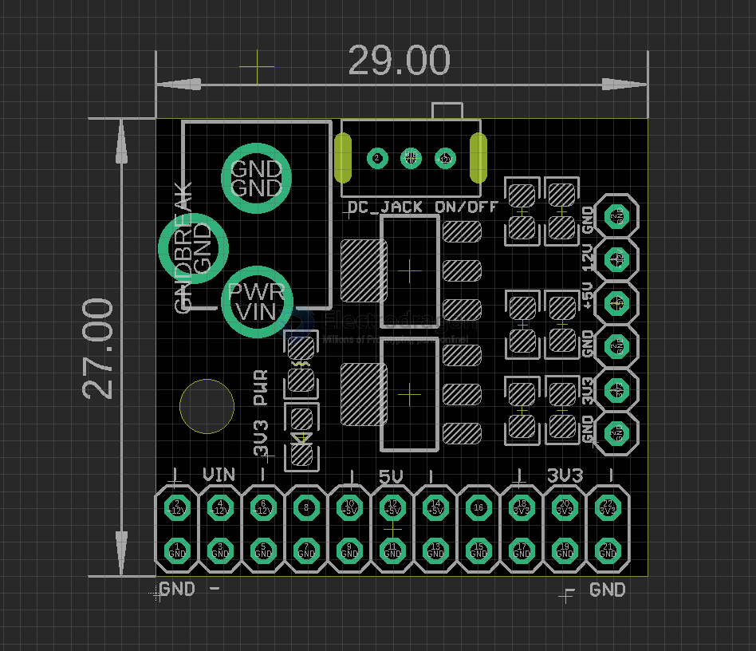

# OPM1095-dat 

[DC Power Supply Buck Module, VIN, 5V, 3.3V R3](https://www.electrodragon.com/product/mutiple-output-dc-power-module/)

## Input Output 

- Input = 7-12V from DC barrel Jack or pin headers 
  - idealy using 9V 1A power plug
  - 12V power plug is working but will be HOT, depends on the load current
- Ouput1 = 5V 1A
- Output2 = 3.3V 2A 

## demo video 

- https://t.me/electrodragon3/331

## ref 

- [[AMS1117-dat]] - [[LDO-dat]]

- [[power-level-dat]] - [[12V-dat]] - [[9V-dat]] - [[5V-dat]]

- [[power-supply-lab-dat]]

- [[ESP8266-dat]]

[[OPM1095]]

