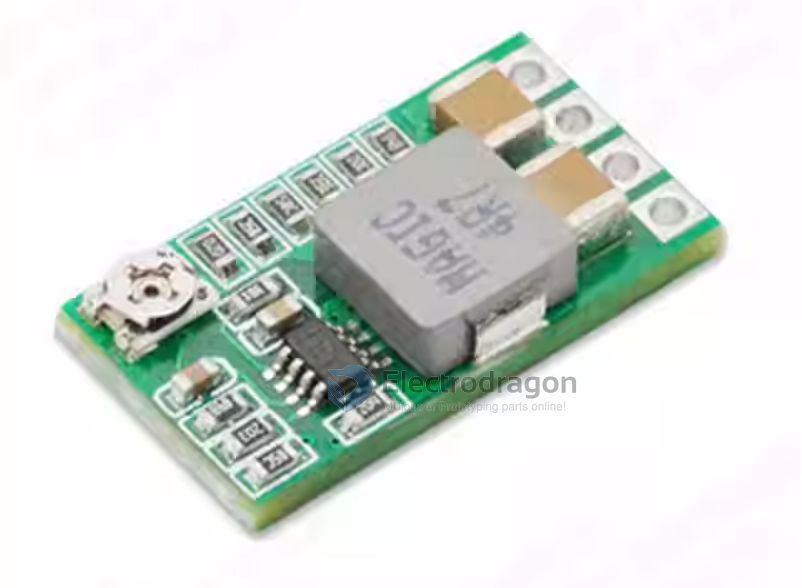
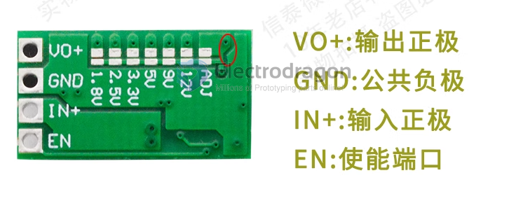

# OPM1104-dat

## Pins

- VO+: Output
- GND: Common Ground
- IN+ Input
- EN: Enable

Tuning

- The default output is adjustable.
- If you need to fix the output voltage, use a knife to cut off the connection in the red circle, and then use solder to connect the pad at the voltage position you need·

## Features

- Use brand new original chips imported from the United States, definitely not domestic chips, disassembled chips.
- The output current should not be greater than 3A, 2.1A for long-term operation, and the margin is sufficient.
- Using a new scheme design
  - the circuit design does not require electrolytic capacitors and tantalum capacitors (electrolytic capacitors have a short life, and tantalum capacitors have the risk of explosion). 
  - 2 large-size solid ceramic capacitors (MCC) used in high-end circuits are used.
- The new solution uses synchronous rectification, and the circuit conversion efficiency is very high. 
  - When converting 6.5V to 5V 0.7A, the efficiency is as high as 97.5%. 
  - When converting 12v to 5V IA, it also reaches 94%. 
  - Unlike some peers, the efficiency is only 60.70. %. (The efficiency test removes the voltage drop of the input reverse protection diode and fuse).
- Use high-current shielded inductor and ultra-low internal resistance to improve conversion efficiency. Reduce calorific value.
- Small size, 20 (length) * 11 (width) * 5 (height) mm,
- Low quiescent current, quiescent current 0.85 mA. No need to add a switch when connecting to the car battery, it can be connected to the cigarette lighter cord or ACC power cord.
- The output integrates adjustable and fixed voltages. The fixed output does not need to be customized. 
  - It can be spot welded directly on the board. 
  - It is very suitable for voltage and can be adjusted with a potentiometer. 
  - It is very versatile.
- Integrated enable port, the default is the working mode, low level is turned off, which brings convenience to control
-  Can be used to replace 78 series linear regulators, such as 7805, 7812, etc.

## Specs

- Module properties: non-isolated buck module (BUCK) synchronous rectification
- Input voltage: DC 4.5-24V
- Output voltage: integrated adjustable and fixed output
  - fixed output voltage can be selected on the back
  - Adjustable range (0.8.17V)
  - Fixed voltage (1.8V2.5V3.3V5V9V12v)
- Output current: no more than 3A 
  - (please pay attention to heat dissipation when fully loaded)
  - the actual test input is 12v
- No special heat dissipation is required when the output is within 1.5A.
- Conversion efficiency: up to 97.5% (6.5 to 5V0·7A)

- Switching frequency: 500KHz
- Output ripple: about 20mV (12v to 5V3A) 20M bandwidth
- Working temperature: industrial grade G40℃ to +85℃) (the higher the ambient temperature, the smaller the output power)

| Spec                                |                                                  |
| ----------------------------------- | ------------------------------------------------ |
| Output overvoltage protection       | none                                             |
| Full load temperature rise          | 40℃                                              |
| Quiescent current                   | 0·85 mA                                          |
| Load regulation                     | ±1%                                              |
| Voltage regulation rate             | ±0.5%                                            |
| Dynamic response speed              | 5% 200uS                                         |
| Output short circuit protection     | Yes, please do not short circuit for a long time |
| Input reverse connection protection | None, input reverse connection protection diode  |
| Enable control                      | yes, note-1                                      |
| Soldering method                    | Soldering                                        |
| Input method                        | Soldering                                        |
| Output method                       | Soldering /pin header                            |
| Soldering hole spacing              | 2.54 mm                                          |

- note-1: high level works, low level stops working, high level is 2.5V, low level is about OV. By default, it has an internal pull-up to the positive input.

## ref

- [[MP2315-dat]] - [[MPS-dat]]

- [[OPM1104]]
