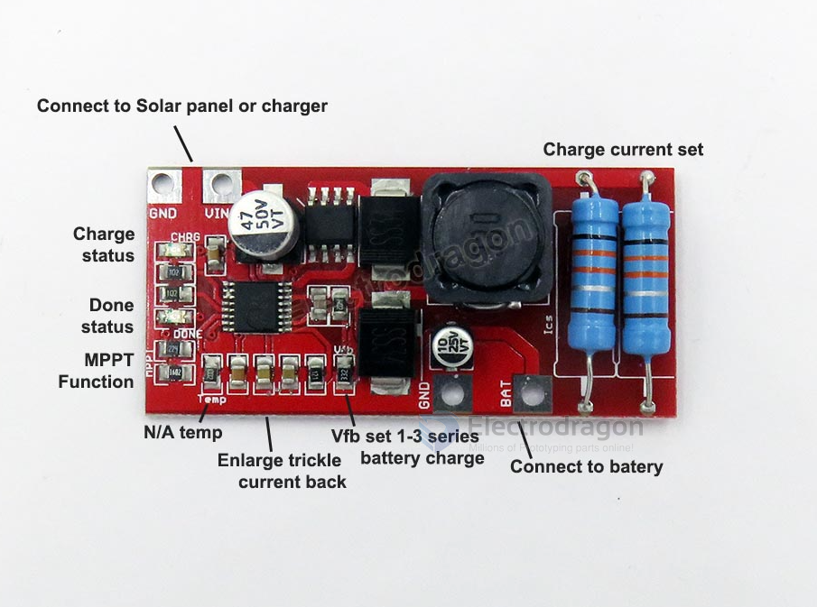
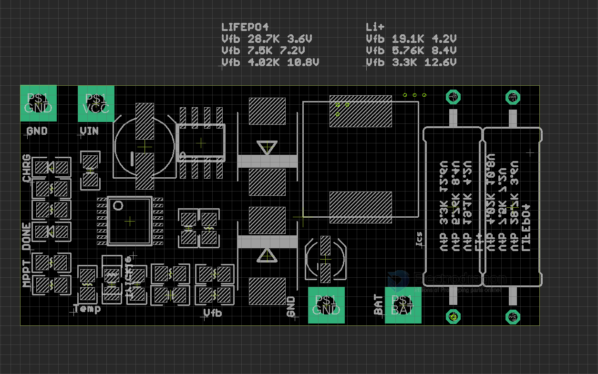

# OPM1146-dat

https://www.electrodragon.com/product/1-3-series-lithium-lilifepo4-battery-charger/

legacy wiki page - https://www.electrodragon.com/w/Battery_Charge

Lithium or LiLiFePO4 Battery Charger, Support 1-3 Series

## Resistor divider for feedback:

- Please notice default Rvfb is 3.3K.
- Change Vfb resistor to set this stop voltage
- All the rest SMD resistors are included in the package.
- Supply VCC should be +2V > Vbat

## Board Functions 

| Charge Target            | Regulation Voltage | Rv_fb voltage feedback resistor selection |
| ------------------------ | ------------------ | ----------------------------------------- |
| LIFEPO4 1 Series         | 3.6V               | 28.7K                                     |
| LIFEPO4 2 Series         | 7.2V               | 7.5K                                      |
| LIFEPO4 3 Series         | 10.8V              | 4.02K                                     |
| Lithium ion Li+ 1 Series | 4.2V               | 19.1K                                     |
| Lithium ion Li+ 2 Series | 8.4V               | 5.76K                                     |
| Lithium ion Li+ 3 Series | 12.6V              | 3.3K                                      |

## Demo 

- A rough testing here, more tutorial can google or please email us.
- https://twitter.com/electro_phoenix/status/988636991171452930

## ref 

- [[CN3722-dat]]