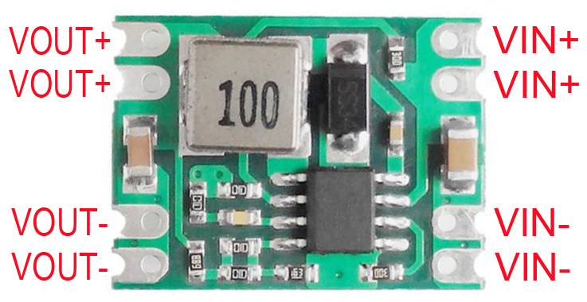
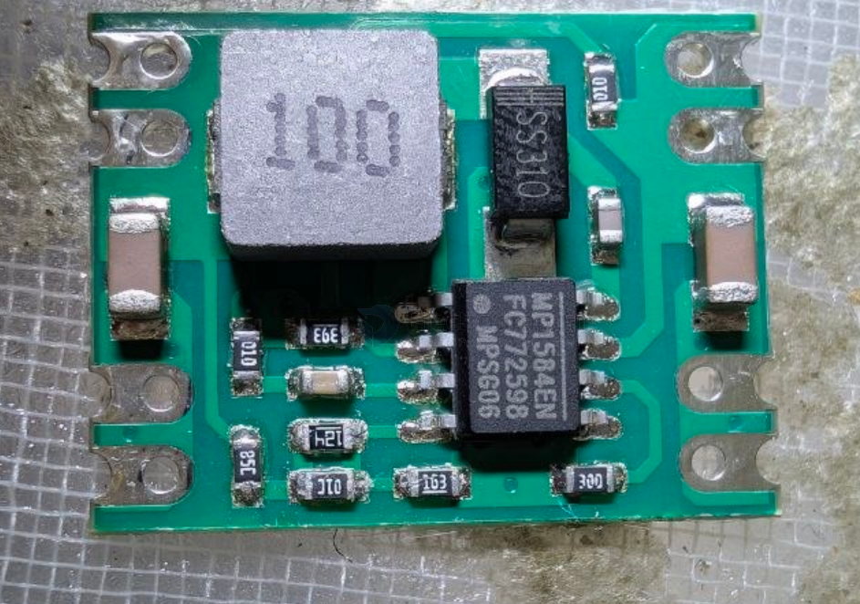
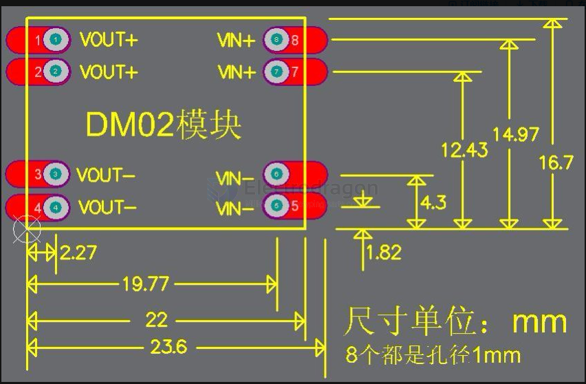

# OPM1153 dat 

## Board Map 

- [[resistor-0603-dat]] - [[resistor-dat]]

85K - 120K|10K - 16K 

V = (85/16+1) x 0.8 = 5.05V 

edit 

    V = (85/8+1) x 0.8 = 9.3V 
    V = (85/8.2+1) x 0.8 = 9.09V 
    V = (85/7.5+1) x 0.8 = 9.87V 

## specs 

up to 3000mA output 

## dimension 

## apps 

- [[USB-type-c-dat]]

## ref 

- [[opm1153]]
  

- [[MP1584-DAT]] - [[OPM1152-dat]]