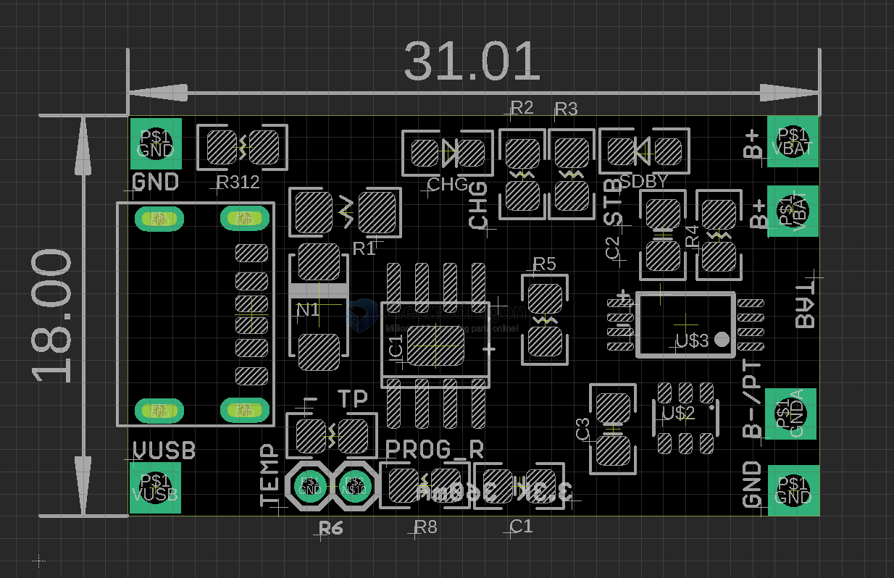

# OPM1156-dat

[TP4056 Lithium Battery Charger R4](https://www.electrodragon.com/product/tp4056-lithium-battery-charger-r3/)

## Board map 

- Battery with    protection on pins B+ and B-/PT
- Battery without protection on pins B+ and GND
- Charging power supply in VUSB / GND
- Temperature Limits default OFF while placed 0R resistor, remove it to enable it
- CHG: charging indicator 
- SDBY: charging done indicator 
- default charging current 360mA by 3k3 R8 resistor 

on board power jack connector == 2P1.25 (2P), note not soldered 

## ref 

- [[TP4056-dat]]

- [[battery-charger-dat]] - [[battery-protection-dat]] - [[power-protection-dat]]
