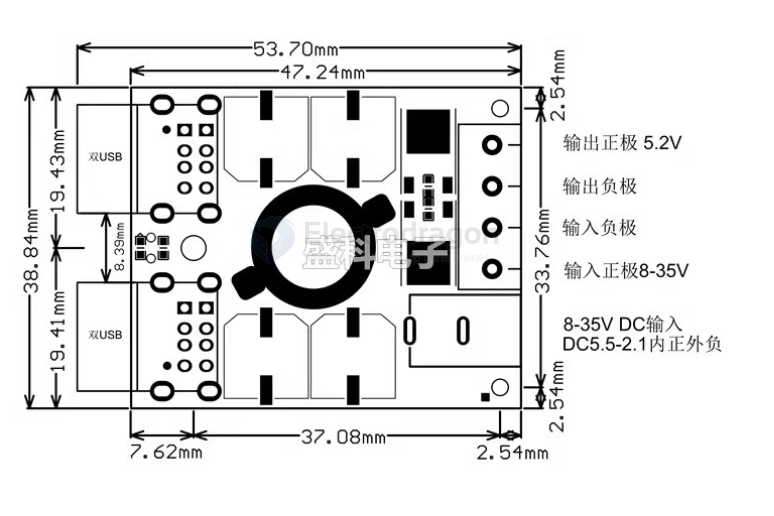

# OPM1160-dat

DC-DC Buck 4 USB Charger Module 8A (#OPM1160)

https://www.electrodragon.com/product/dc-dc-buck-4-usb-charger-module-8a/

## demo video 

https://twitter.com/electro_phoenix/status/1023474043456909312

## Dimension 

## use guide

- for this module, consider add - Adhesive Solutions on PCBs - [[PCB-Adhesive-dat]]
- or layered plastic case [[layered-case-dat]]

## CN

模块参数：
- 输入电压：DC 8-35V
- 输入电流：6A
- 输出电压：5.2V
- 输出电流：总最大10A，电流自适应，手机单口充电最大2.4A。
- 动态响应速度：300us (负载流流变化5%）
- 转换效率：95%（12V转5.2V3.5A测得，效率跟压差和负载大小有关。）
- 负载调整率：0.2-0.3%（10%-50%负载 12V输入测得）
- 纹波&噪声：120mVP-P（20MHz带宽 12V转5.2V3A测得）
- 开关频率：100KHz
- 空载电流：18mA (12V车5V测得）
- 接线方式：IN输入  OUT输入  接线端子 DC座
- 固定方式:M3*1    M2*2
- 净重：约44克

## ref 

- [[OPM1160]]

