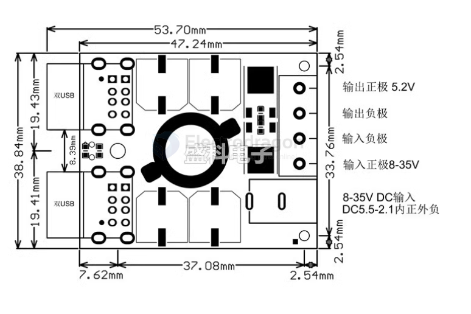
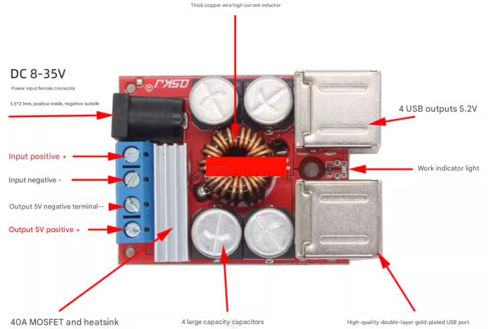

# OPM1160-dat

[DC-DC Buck 4 USB Charger Module 8A (#OPM1160)](https://www.electrodragon.com/product/dc-dc-buck-4-usb-charger-module-8a/)

## demo video 

https://twitter.com/electro_phoenix/status/1023474043456909312

## Dimension 

## use guide

- for this module, consider add - Adhesive Solutions on PCBs - [[PCB-Adhesive-dat]]
- or layered plastic case [[layered-case-dat]]

## Features

1. Four independent dedicated charging management IC channels — supports high-current charging for a wide range of phones; fast and reliable charging.
2. Charger identification IC compatible with Apple and Android devices — most phones can reach their fastest supported charging speed.
3. Supports four USB ports charging simultaneously at ~2 A each; large total current and fast charging — total output current up to 10 A.
4. Input MOSFET reverse-polarity protection to improve conversion efficiency and reduce losses.
5. Output over-voltage protection to safeguard connected devices.
6. Wide input voltage range: 8–35 V — suitable for 12 V and 24 V automotive systems.
7. Synchronous-rectification topology reduces heat and improves efficiency (efficiency up to ~96% in ideal conditions).
8. Heavy‑copper, high‑current inductor for low heating and high conversion efficiency.
9. Four high-quality SMD capacitors plus large-capacity MLCCs reduce output ripple and EMI.
10. High-quality double-layer gold-plated USB connectors — approximately twice the lifetime of ordinary USB ports.

## Specifications

| Parameter                   |                                                                                 Value |
| --------------------------- | ------------------------------------------------------------------------------------: |
| Input voltage               |                                                                           DC 8 – 35 V |
| Input current (max)         |                                                   6 A (recommended supply capability) |
| Output voltage              |                                                                       5.2 V (nominal) |
| Output current              |                     Total max 10 A; per-port adaptive current; single-port max ~2.4 A |
| Dynamic response            |                                                             300 µs (for 5% load step) |
| Conversion efficiency       | ~95% measured (12 V → 5.2 V @ 3.5 A). Actual efficiency depends on VIN−VOUT and load. |
| Load regulation             |                                        0.2 – 0.3% (measured 10%–50% load, 12 V input) |
| Ripple & noise              |                           ~120 mV p‑p (20 MHz bandwidth, measured 12 V → 5.2 V @ 3 A) |
| Switching frequency         |                                                                               100 kHz |
| Quiescent / no‑load current |                                                    ~18 mA (measured from 12 V to 5 V) |
| Connectors / wiring         |                                         IN / OUT terminal block and DC jack supported |
| Mounting                    |                                                         M3 × 1, M2 × 2 mounting holes |
| Net weight                  |                                                                                 ~44 g |

## ref 

- [[OPM1160]]

