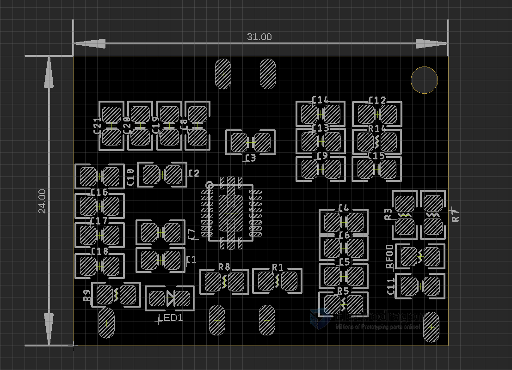

# OPM1168 dat 

BQ51050 supports 4.2V lithium battery up to 1A charge management.

[product url - BQ Wireless Charge Receiver Board QI](https://www.electrodragon.com/product/wireless-charge-receiver-board-qi/?attribute_pa_qi=bq51050)

- First two pads = + positive BAT
- seconds two pads right = - negative GND

## charge current 

Where 
- IBULK is the programmed battery charge current during fast charge mode. When referring to the application diagram shown in Figure 32, 
- RILIM is the sum of RFOD and R1 (the total resistance from the ILIM pin to PGND).

https://www.ti.com/lit/ds/symlink/bq51050b.pdf

## demo 

https://www.youtube.com/shorts/D4PBTednAjU

## ref 

- [[wireless-charge-dat]] - [[TI-power-dat]]

- [[OPM1168]]