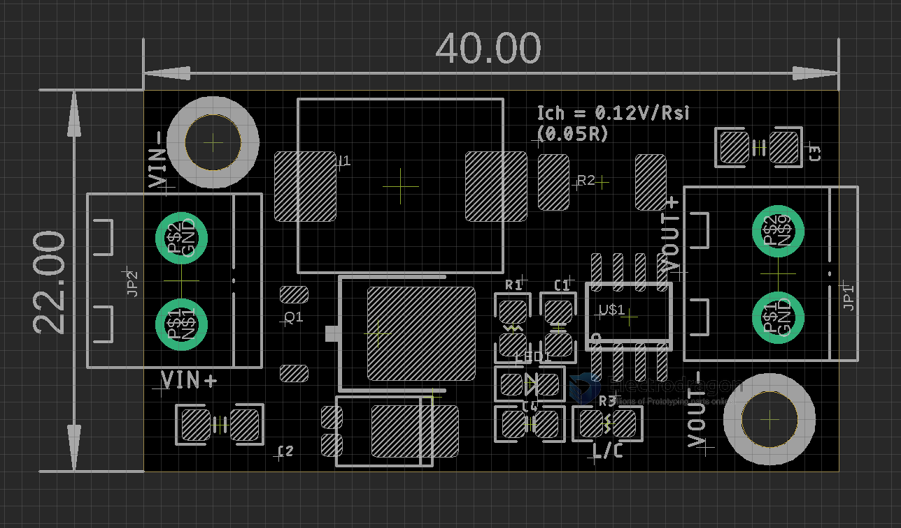

# OPM1181-dat 

[12V Lead-acid Battery Charger Module CN3768](https://www.electrodragon.com/product/12v-lead-acid-battery-charger-module-cn3768/)

read more information at chip page [[CN3768-dat]]

## Set charged current at 

0.15V / 0.05 R = 2.4A

## Note 

Notice if you run high charging current, add heat sink on backside would be good.

- fully charged voltage at around 13.55V
- over-charged voltage at around 14.8V

Please note it may take a long time to fully charge a battery.

## Dimension 

## ref

- [[consonance-dat]] - [[CN3768-dat]]

- [[rechargerable-battery-dat]] - [[battery-dat]]

- [[battery-Lead-acid-dat]]

- [[OPM1181]] - [[CN3768]]