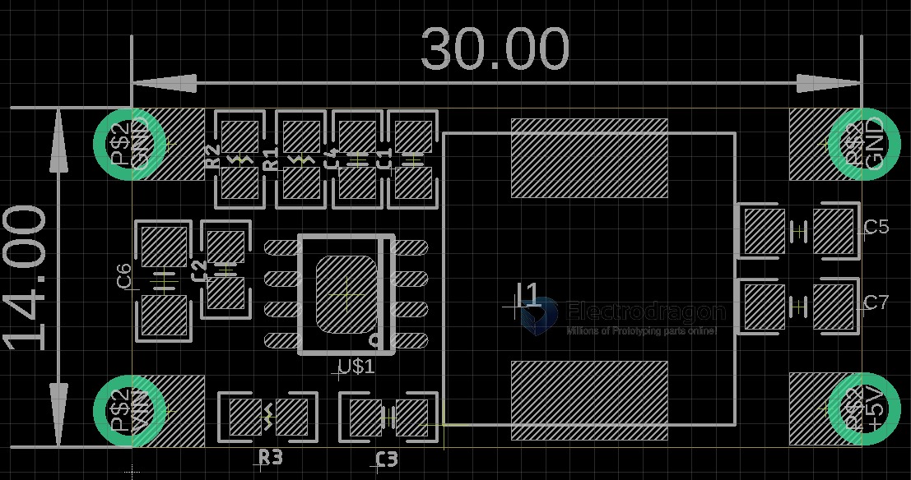

# OPM1192 dat 

https://www.electrodragon.com/product/dcdc-buck-power-supply-module-4-5-30v-5a/

default output 3.3V, customized 5V 

## Output Setup 

R2 = 0.6/(V-0.6)*R1

R2 = 0.6/(3.3-0.6) * R1 = 22K

R2 = 0.6/(5-0.6) * R1 = 13.6K

## ref

- [[OPM1192]]

- [[dcdc-dat]]

