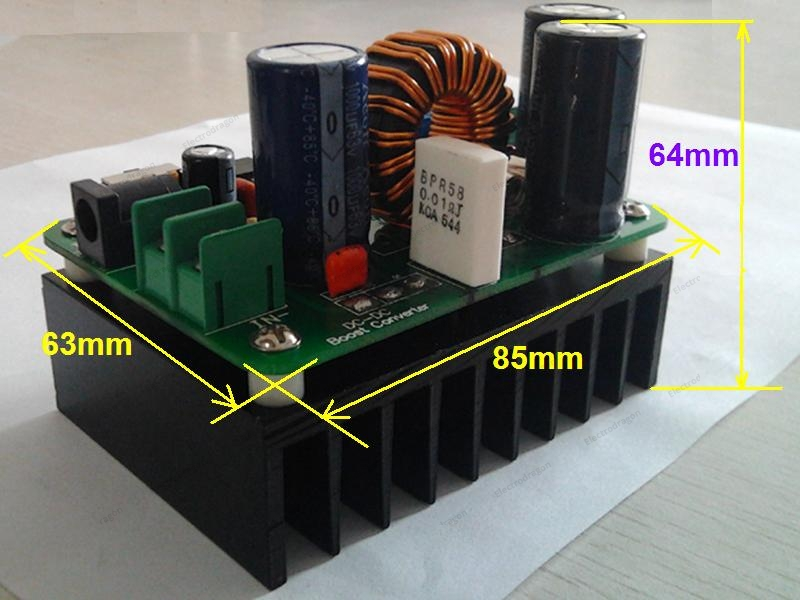

# OPMS022-dat

600W DC-DC Step-Up Module 10-60V to 12-80V

https://www.electrodragon.com/product/600w-dc-dc-step-up-module-10-60v-to-12-80v/

## Dimension 

## use guide 

The module application example:

An input voltage of 12V current 4.17A, boost output voltage of 20V current 2.4A, module efficiency of 97%

Input voltage of 54V current 13.5A, output 58V current 12A use 5Ω1Kw resistor as a load test, an efficiency of 95%, Module output 965W

## demo video 

- [A demo video is shown that how it boost 100W LED, see it here.](https://www.electrodragon.com/?p=8309)